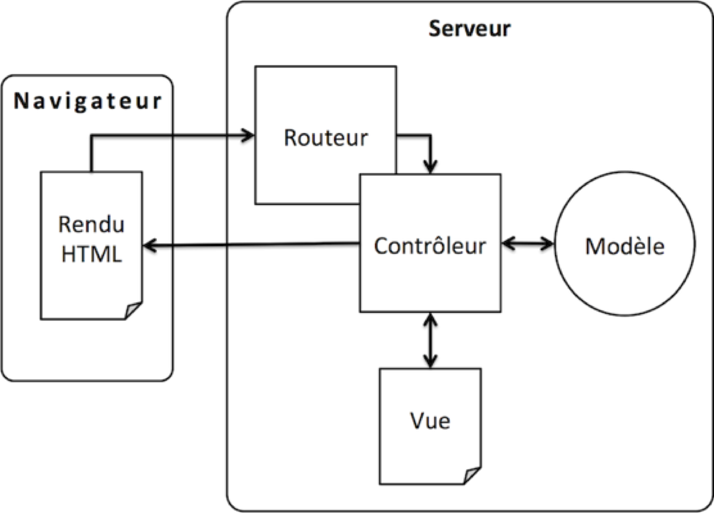
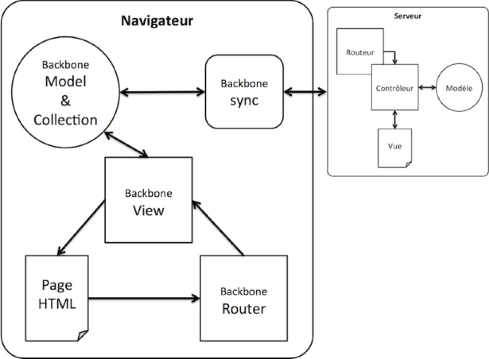

#Présentation de Backbone & rappels MVC

>*Sommaire*

>>- *A quoi sert Backbone.js ?*
>>- *Qu’est-ce qu’une « Webapp » ?*
>>- *Petit rappel à propos de MVC*

>*Où nous allons voir pourquoi Backbone existe et quels sont les grands principes qu’il met en œuvre.*

Ce chapitre est très court, il présente les origines de Backbone.js, le pourquoi de son utilisation, et enfin un rappel sur le patron de conception Modèle-Vue-Contrôleur, essentiel pour la bonne compréhension du framework.

##Backbone ? Webapps ? MVC ?

Backbone est un framework javascript dédié à la création de **Webapps** en mode **"Single Page Application"**. Il implémente le pattern MVC (l'acronyme signifie : Model View Controller / Modèle Vue Contrôleur) mais, et c'est là qu'est la nouveauté, côté client, plus précisément au sein de votre navigateur. Il reproduit les mécanismes des frameworks MVC côté serveur tels Ruby on Rails, CakePHP, Play!>Framework, ASP.Net MVC (avec Razor)…
Backbone a été écrit par Jeremy Ashkenas (le papa de Coffeescript et de Underscore) à l’origine pour ses propres besoins lors du développement du site [DocumentCloud](http://www.documentcloud.org/home)). Son idée était de créer un framework qui permette de structurer ses développements en s’appuyant justement sur MVC.
Mais avant toute chose, faisons quelques petits rappels (ou découvertes ?).

###Qu’est-ce qu’une “Webapp” ?

Une “Webapp” n’a pas la même vocation qu’un site Web même si les technologies mises en œuvre sont les mêmes. Elle a une réelle valeur applicative (gestion de catalogue produits, utilitaires, client mails, agenda, etc.) contrairement au site Web qui le plus souvent est un médium de communication (journaux, blogs, etc.). Assez rapidement, les technologies Web ont été détournées pour tenter de remplacer les applications de gestion “client-riche” classique. Imaginez, le rêve des DSI : plus de déploiement, tout se passe dans le navigateur. Cependant, c’était compter sans les utilisateurs. Je me souviens avoir vu, il y a plus d'une dizaine d’années, une gestion de catalogue, en ASP 3 où, à chaque création d’article, il fallait attendre que toute la liste des articles se recharge. Ce qui en mode texte (sous Dos) prenait 1 minute avant, venait de prendre 3 à 5 minutes dans la vue : 3 à 5 fois plus de temps ! Bravo la productivité ! Ensuite les technologies se sont cherchées longtemps pour tenter de remédier à ce problème : utilisation des applets java (qui existaient depuis un moment), des ActiveX (MS qui veut faire comme Sun) et là on commençait à retomber dans les travers de déploiements compliqués. Puis il y eu Flash, Flex et Silverlight, pas mal du tout il faut l’avouer, mais parallèlement le moteur javascript avait évolué, les navigateurs aussi et avec l’avènement du triptyque HTML5 – CSS3 – Javascript, un nouveau concept est apparu, la “Single Page Application” (probablement boosté par les mobiles, les tablettes… et Steve Jobs refusant que Flash/Air/Flex & Java s’installent sur l’iPhone & l’iPad). Mais qu’est donc une “Single Page Application” ? Il existe moult définitions, je vais donc vous donner la mienne, ensuite ce sera à vous de vous construire votre vision de “l’application Web monopage”.

Une "Single Page Application est une application Web qui embarque tous les éléments nécessaires à son fonctionnement dans une seule page HTML. Les scripts javascript liés seront chargés en même temps. Ensuite l’application Web chargera les ressources nécessaires (généralement des données, des images…) à la demande en utilisant Ajax, évitant ainsi tout rechargement de page et procurant une expérience utilisateur proche de celle que nous connaissions en mode “client-serveur”, voire meilleure dans certains cas. Ces webapps nouvelle génération peuvent aussi fonctionner offline en profitant des possibilités des derniers navigateurs (localStorage).

>>**Remarque** *: ce qui est amusant, c’est que dès 1999 ou 2000, Microsoft avait déjà introduit cette possibilité avec Internet Explorer 4 qui intégrait une applet Java (si si !) qui permettait de faire du Remote Protocol Call d’une page html vers le serveur sans recharger la page et en s’abonnant en javascript à l’évènement de retour (à vérifier, c’est loin, tout ça). Mais ce fut éclipsé par l’apparente simplicité de mise en œuvre des ActiveX (Flash était alors utilisé principalement pour de l’animation, mais permettait aussi ce genre d’artifice).*

Tout ça c’est bien beau, mais vous savez comme moi qu’un code HTML+JS (+CSS) peut rapidement devenir un plat de spaghettis impossible à maintenir, pour les autres comme pour vous (retournez dans votre code 6 mois plus tard ;)). Il faut donc s’astreindre à des règles et s’équiper des bons outils afin de se faciliter la tâche, ne pas avoir à réinventer la poudre à chaque fois et pouvoir coder des applications robustes facilement modifiables (faciles à corriger, faciles à faire évoluer). Et si en plus vous pouvez vous faire plaisir…

C’est de ce constat qu’est parti Jeremy Ashkenas, et c’est en mettant en pratique les préceptes depuis longtemps éprouvés de MVC qu’il a conçu Backbone, pour répondre à une problématique existante, ce qui le rend d’autant plus légitime.
Rafraîchissons donc un peu notre mémoire à propos de MVC.

>>**Remarque** *: pour les lecteurs qui ne connaîtraient pas ce concept, ne refermez pas le livre tout de suite, vous verrez avec les exemples pratiques que le concept est simple et facilement assimilable. Donc si les quelques paragraphes théoriques qui suivent vous semblent obscurs, je vous promets que dans quelques chapitres vous aurez tout compris.*

###Petit rappel : MVC ?

MVC est un pattern (modèle) de programmation utilisé pour développer des applications de manière structurée et organisée. Le pattern MVC, comme tous les patterns, cadre votre façon de développer. Son objectif particulier est de séparer les responsabilités de vos "bouts" de code en les regroupant selon 3 rôles (responsabilités) : le modèle donc, la vue et le contrôleur. Détaillons-les :

- **la vue** : c'est l'IHM (Interface Homme-Machine), ce qui va apparaître à l'écran de l'utilisateur. Elle va recevoir des infos du contrôleur ("affiche moi ça !"), elle va envoyer des infos au contrôleur ("on m'a cliquée dessus, il me faut la liste des clients")
- **le contrôleur** : c'est lui donc qui reçoit des infos de la vue, qui va aller récupérer des données métiers chez le modèle ("j'ai besoin pour la vue de la liste des clients"), et va les renvoyer à la vue et éventuellement appliquer des traitements à ces données avant de les renvoyer.
- **le modèle** : c'est votre  objet client, fournisseur, utilisateur... avec toute la mécanique qui sert à les sauvegarder, les retrouver, modifier, supprimer...

>>**AVERTISSEMENT 1** *: C’est la lisibilité qui importe. Il peut y avoir des interprétations différentes du modèle MVC quant aux responsabilités de ses composants. Par exemple, est-ce le modèle qui se sauvegarde lui-même ou est-ce un contrôleur qui se chargera de la persistance ? Peu importe (ce sont des querelles de chapelles), gardons juste à l'esprit qu'il y a trois grands modes de classement de nos objets et que l'important est d'avoir un code propre, structuré et maintenable (dans 6 mois, vous devez être capables de relire votre code).*

>>**AVERTISSEMENT 2** *: La difficulté n’est plus de mise. À l'attention des réfugiés de STRUTS. mon "1er contact" avec MVC a été avec STRUTS. J'ai trouvé l'expérience peu concluante (expérience développeur désastreuse) et je suis retourné faire de l'ASP.Net "à la souris" (c'était avant 2005). Si certains d'entre vous se sont éloignés de la technique et ont des velléités de s'y remettre mais sont effrayés par MVC, je les rassure tout de suite, les développeurs nous ont enfin "concocté" des frameworks simples et faciles à mettre en œuvre tels :*

>>- *ASP.Net MVC avec le moteur de template Razor*
>>- *Play!>Framework*
>>- *Express.js (avec nodeJS)*
>>- *Et beaucoup d'autres*

*Backbone.js respecte ce principe. Donc n'ayez pas peur, cela va être facile ;)*

L'interprétation de MVC par Backbone est un peu particulière et les développeurs Java, .Net, PHP, Ruby, Python, etc. pourraient être surpris. Mais passons donc à quelques explications.

##Backbone & MVC

Backbone "embarque" plusieurs composants qui vont nous permettre d'organiser notre webapp selon les "préceptes" MVC et simplifier les communications avec le serveur (avec le code applicatif côté serveur).

Voyons l'interprétation que fait Backbone du modèle MVC :

- Le composant **Modèle** (selon Backbone : `Backbone.Model`) représente les données qui vont interagir avec votre code "backend" (côté serveur) via des requêtes Ajax. Ce sont eux qui auront la responsabilité de la logique métier et de la validation des données.
- Le composant **Vue** (selon Backbone : `Backbone.View`) n'est pas complètement une vue au sens où on l'entend habituellement (couche présentation). Dans le cas qui nous intéresse, la "vraie" vue est un fragment de code "natif" HTML dans la page Web qui s'affiche dans le navigateur (il y a donc plusieurs vues dans une même page). Et `Backbone.View` est en fait un **Contrôleur de vues** (1) (vous verrez, ce sera plus facile à appréhender en le codant) qui va ordonnancer les événements et interactions au sein de la page Web.

>>*(1) C'est une interprétation très personnelle, c'est discutable, je reste à votre disposition*

Pour résumer, avec un parallèle avec du MVC dit "classique", nous avons :

- Modèle : `Backbone.Model`
- Vue : le code HTML
- Contrôleur (de vues) : `Backbone.View`

**Mais ce n'est pas fini !** Backbone apporte 3 composants supplémentaires :

- Le composant **Routeur** : `Backbone.Router`, qui écoute/surveille les changements d'URL (dans la barre d'url du navigateur, lors d'un clic sur un lien…) et qui fait le lien avec les `Backbone.Model(s)` et les `Backbone.View(s)`.
- Le composant **Collection** : `Backbone.Collection`, des collections de modèles avec des méthodes pour "travailler" avec ceux-ci (each, filter, map…)
- et enfin le petit dernier, mais non des moindres, Le composant de **Synchronisation** `Backbone.sync`, que l'on pourrait comparer à une couche middleware, qui va permettre à nos modèles de communiquer avec le serveur. C'est `Backbone.sync` qui va faire les requêtes Ajax au serveur et "remonter" les résultats aux modèles.

***Figure 1-1. MVC Vision "Back-End"***

***Figure 1-2. MVC Vision "Front-End"***

##Pourquoi j’ai choisi  Backbone ?
 
	//TODO:

Tout ceci vous paraît bien théorique ? Alors passons tout de suite à la pratique.

