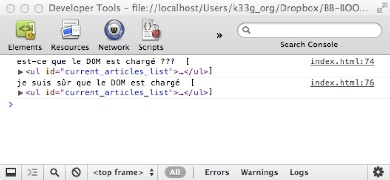
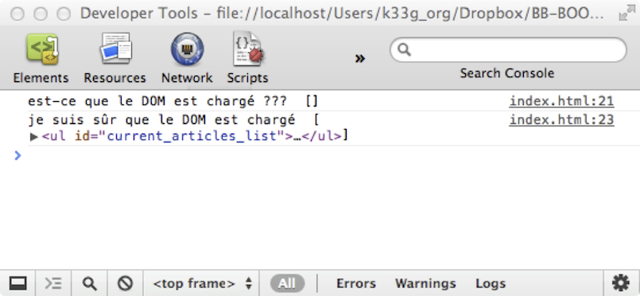

#Tout de suite “les mains dans le cambouis”

>*Sommaire*

>>- *Les prérequis & IDE pour faire fonctionner Backbone*
>>- *jQuery en 15 minutes*
>>- *Underscore.js en 10 minutes*


>*Où nous allons lister les éléments nécessaires pour installer Backbone et commencer à développer avec.*

Le plus frustrant lorsque l'on débute la lecture d'un ouvrage informatique dans l'optique de s'auto-former c'est que l'on est obligé de lire de nombreux chapitres avant de pouvoir commencer à s'y mettre. Je vais donc tenter de vous faire faire un 1er tour de Backbone.js en 20 minutes pour que vous en saisissiez rapidement la "substantifique moelle". Mais avant d’utiliser Backbone, quelques prérequis sont nécessaires.
 

##Prérequis : les dépendances de Backbone

Backbone a besoin au minimum de deux autres frameworks javascript pour fonctionner :

- **Underscore.js** par le créateur de Backbone. Underscore est un ensemble d'outils qui permettent d'étendre javascript et qui vont vous faciliter la vie dans la gestion des Collections, Arrays, Objects... mais aussi vous permettre de faire du templating (nous verrons plus loin ce que c'est). Le gros avantage d'Underscore, c'est qu'il fonctionne quel que soit votre navigateur (comme Backbone). Underscore est une dépendance de Backbone, il est donc indispensable.
- **jQuery**, qui est un framework dédié à la manipulation des éléments de votre page HTML (on parlera du DOM, Document Object Model) mais aussi aux appels de type Ajax (nécessaires pour "discuter" avec le serveur). On peut dire que jQuery est un DSL (Domain Specific Language) pour le DOM. jQuery n'est pas indispensable pour faire fonctionner Backbone, mais il va grandement nous faciliter la vie dans la création de nos Webapps et va nous garantir le fonctionnement de notre code quel que soit le navigateur.

Nous verrons dans quelques chapitres qu'il est tout à fait possible de "marier" d'autres frameworks javascript à Backbone pour :

- faire du templating (certains peuvent trouver la fonctionnalité de template d'Underscore limitée)
- gérer la persistance locale (localStorage du navigateur)
- ...

>>**Remarque :** *Il est possible d'utiliser Zepto.js à la place de jQuery, Zepto fonctionne à l'identique de jQuery mais il est dédié principalement aux navigateurs mobiles et est beaucoup plus léger que jQuery (avantageux sur un mobile), cependant vous n'avez plus la garantie que votre code fonctionne dans d'autres navigateurs (Zepto "marchera" très bien sous Chrome, Safari et Firefox).*

##Outils de développement

###IDE (Éditeur)

Pour coder choisissez l'éditeur de code avec lequel vous vous sentez le plus à l'aise. Ils ont tous leurs spécificités, ils sont gratuits, open-source ou payants. Certains "puristes" utilisent même Vim ou Emacs. Je vous en livre ici quelques-uns que j'ai trouvés agréables à utiliser si vous n'avez pas déjà fait votre choix :

- Mon préféré mais payant : WebStorm de chez JetBrains, il possède des fonctionnalités de refactoring très utiles (existe sous Windows, Linux et OSX)
- Dans le même esprit et gratuit : Netbeans, il propose un éditeur HTML/Javascript très pertinent quant à la qualité de votre code (existe sous Windows, Linux et OSX)
- Textmate (payant) un éditeur de texte avec colorisation syntaxique, un classique sous OSX
- SublimeText (payant) un peu l'équivalent de Textmate mais toutes plateformes
- Un bon compromis est KomodoEdit dans sa version communauté (donc non payant) et qui lui aussi fonctionne sur toutes les plateformes.
- Aptana fourni aussi un bon IDE dédié Javascript sur une base Eclipse, mais je trouve qu'il propose finalement trop de fonctionnalités (comme Eclipse), et personnellement je m’y perds.

Vous voyez, il y en a pour tous les goûts. En ce qui me concerne j'utilise essentiellement WebStorm ou SublimeText.

###Navigateur

Le navigateur le plus agréable à utiliser pour faire du développement Web est, selon moi, certainement Chrome (c'est un avis très personnel, donc amis utilisateurs de Firefox ne m'en veuillez pas). En effet, Chrome propose une console d'administration particulièrement puissante. C'est ce que je vais utiliser, rien ne vous empêche d'utiliser votre navigateur préféré. Par contre, que cela ne vous dispense pas d'aller tester régulièrement votre code sous d'autres navigateurs.

##Initialisation de notre projet de travail

Maintenant que nous sommes “outillés” (un éditeur de code et un navigateur) nous allons pouvoir initialiser notre environnement de développement.

###Installation

- Créer un répertoire de travail `backbone001`
- Créer ensuite un sous-répertoire `libs` avec un sous-répertoire `vendors`

Nous copierons les frameworks javascript dans `vendors`.

- Téléchargez **Backbone** : [http://documentcloud.github.com/backbone/](http://documentcloud.github.com/backbone/)
- Téléchargez **Underscore** : [http://documentcloud.github.com/underscore/](http://documentcloud.github.com/underscore/)


>>**CONSEIL** *: Utilisez les versions non minifiées des fichiers. Il est toujours intéressant de pouvoir lire le code source des frameworks lorsqu'ils sont bien documentés, ce qui est le cas de Backbone et Underscore. N'hésitez pas à aller mettre le nez dedans, c'est instructif et ces 2 frameworks sont très lisibles, même pour des débutants.*

- Téléchargez **jQuery** : [http://jquery.com/](http://jquery.com/)

Nous allons aussi récupérer le framework CSS **Twitter Bootstrap** qui nous permettra de faire de "jolies" pages sans effort. Ce n'est pas du tout obligatoire, mais c'est toujours plus satisfaisant d'avoir une belle page d'exemple. Téléchargez `bootstrap.zip` : [http://twitter.github.com/bootstrap/](http://twitter.github.com/bootstrap/), "dé-zippez" le fichier et copiez le répertoire `bootstrap` dans votre répertoire `vendors`.

###Préparons notre page HTML

À la racine de votre répertoire de travail, créez une page index.html avec le code suivant :

```html
<!DOCTYPE html>
<html>
  <head>
		<meta http-equiv="Content-Type" content="text/html; charset=utf-8">
		<title>Backbone</title>
		<meta name="viewport" content="width=device-width, initial-scale=1.0">

		<!-- === Styles Twitter Bootstrap -->
		<!--V 3.0.1 ...-->
		<link href="libs/vendors/bootstrap/css/bootstrap.css" rel="stylesheet">
		<link href="libs/vendors/bootstrap/css/bootstrap-theme.css" rel="stylesheet">
  </head>

  <!-- === ici votre IHM === -->
  <body>


  </body>
  <!-- === Références aux Frameworks === -->
  <script src="libs/vendors/jquery.js"></script><!--V 1.10.2 -->
  <script src="libs/vendors/underscore.js"></script><!--V 1.5.2 -->
  <script src="libs/vendors/backbone.js"></script><!--V 1.1.0 -->

  <!-- === ici votre code applicatif === -->
  <script>

  </script>
</html>
```

À ce niveau, vous devriez avoir un squelette de projet fonctionnel avec l'arborescence suivante :


Les deux paragraphes qui suivent ne sont là que pour ceux d'entre vous qui ne connaissent ni **jQuery** ni **Underscore**. Ces paragraphes n'ont pas la prétention de vous apprendre ces outils, mais vous donneront les bases nécessaires pour vous en servir, pour comprendre leur utilité et pour vous donner envie d'aller plus loin. Les autres (ceux qui connaissent déjà), passez directement au **§ "1er contact… avec Backbone"**.

##Jouons avec jQuery

JQuery est un framework javascript initialement créé par John Resig qui vous permet de prendre le contrôle de votre page HTML. Voyons tout de suite comment nous en servir.
Dans notre toute nouvelle page `index.html`, préparons un peu notre bac à sable et saisissons le code suivant :

```html
<!DOCTYPE html>
<html>
	<head>
		<meta http-equiv="Content-Type" content="text/html; charset=utf-8">
		<title>Backbone</title>
		<meta name="viewport" content="width=device-width, initial-scale=1.0">

		<!-- === Styles Twitter Bootstrap -->
		<!--V 3.0.1 ...-->
		<link href="libs/vendors/bootstrap/css/bootstrap.css" rel="stylesheet">
		<link href="libs/vendors/bootstrap/css/bootstrap-theme.css" rel="stylesheet">
		
		<!-- === à insérer entre les 2 <link> === -->
		<style>
			body {
				padding-top: 60px;
				/* 60px pour mettre un peu d'espace entre la barre de titre et le contenu */
				padding-bottom: 40px;
			}
		</style>

	</head>

<!-- === ici votre IHM === -->
	<body>
		<!--
		 les classes css "navbar navbar-inverse navbar-fixed-top", "navbar-header", "container",
		 "brand", "jumbotron" (anciennement hero-unit)
		 viennent de la feuille de style "twitter bootstrap v3 !"
		-->
		<div class="navbar navbar-inverse navbar-fixed-top">
	            <div class="navbar-header">
	                <div class="container">
	                    <a class="navbar-brand">Mon Blog</a>
	                </div>
	            </div>
	        </div>

		<div class="container">

			<div class="jumbotron">
				<h1>Backbone rocks !!!</h1>
				<p>
					"Ma vie mon oeuvre"
				</p>
			</div>

			<div id="articles_box">

				<h1 id="current_articles_title">les articles du blogs</h1>

				<ul id="current_articles_list">
					<li>Backbone et les modèles</li>
					<li>Backbone et les vues</li>
					<li>Backbone : mais y a-t-il vraiment un contrôleur dans l'avion ?</li>
				</ul>

				<h1 id="next_articles_title">les articles à venir</h1>

				<ul id="next_articles_list">
					<li>Backbone et le localstorage</li>
					<li>Backbone.sync : comment ça marche</li>
				</ul>

			</div>
		</div>

	</body>
	<!-- === Références aux Frameworks === -->
	<script src="libs/vendors/jquery.js"></script><!--V 1.10.2 -->
	<script src="libs/vendors/underscore.js"></script><!--V 1.5.2 -->
	<script src="libs/vendors/backbone.js"></script><!--V 1.1.0 -->

	<!-- === ici votre code applicatif === -->
	<script>

	</script>
</html>
```

Une fois votre page terminée, sauvegardez-la et ouvrez-la dans votre navigateur préféré (qui je le rappelle, pour des raisons purement pédagogique est Chrome) :


Notez au passage la qualité graphique de votre page ;), tout ça sans trop d'efforts, grâce à Twitter Bootstrap.

###"Jouons" avec notre page en mode commande

Dans un premier temps, ouvrez la console de Chrome (ou Safari) : faite un clic droit sur la page et sélectionner "Inspect Element" (ou "Inspecter l'élément). Pour les aficionados de Firefox : utilisez les menus : Tools/Web Developer/Web Console. Vous devriez obtenir ceci (cliquez sur le bouton "Console" si nécessaire :


####Saisissons nos 1ères commandes :


Je voudrais la liste de mes titres `<H1>` : dans la console, saisir : `$('h1')`, validez, et vous obtenez un tableau (Array au sens javascript) des nodes html de type `<H1>` présents dans votre page html :


Je voudrais le texte de l'élément dont l'id est `"current_articles_title"` : dans la console, saisir : `$('#current_articles_title').text()`. L'identifiant étant unique, en fait le type du node est peu important :


Mais comment dois-je faire pour avoir le texte du premier `<H1>` de ma page, il n'a pas d'id ?!?. Tout simplement, en utilisant la commande suivante : `$('h1').first().text()` :


####Modifions l’aspect de notre page dynamiquement :


Les commandes sont toujours à saisir dans la console du navigateur.
Je voudrais :

- changer le titre de mon blog : `$('h1').first().text("Backbone c'est top !")`, attention pensez bien au `first()` sinon vous allez changer tous les textes de tous les `H1` de la page.
- récupérer le code HTML de la "boîte de titre" (le div avec la classe css : `class="jumbotron"`) : `$('[class="jumbotron"]').html()`, notez bien que `$('[class="jumbotron"]').text()` ne retourne pas le même résultat. On peut aussi écrire ceci plus simplement : `$('.jumbotron').html()` : le `"."` correspond à une classe CSS, comme le `"#"` permet de rechercher un élément par son id.
- changer les couleurs de police et de fond de tous les tags H1 :

	  `$('h1').css("color","white").css("background-color","black")`, vous voyez que vous pouvez faire des appels chaînés, mais une autre possibilité serait la suivante :

	  $('h1').css({color:"yellow", backgroundColor:"green"})


####Allons plus loin…


Je voudrais :

- la valeur de l'id de la deuxième liste (`UL`) : `$('ul').eq(1).attr("id")`, je cherche la liste d'index 1 (le 1er élément possède l'index 0).
- parcourir les lignes (`LI`) de la liste dont l'id est `"next_articles_list"` et obtenir leur texte : `$('#next_articles_list').find('li').each(function (index) { console.log( $(this).text() ); })`
- ajouter une nouvelle ligne à la 2ème liste :

		$('<li>Templating et Backbone</li>').appendTo('#next_articles_list')

- cacher la 1ère liste : `$('#current_articles_list').hide()`
- l'afficher à nouveau : `$('#current_articles_list').show()`
- la cacher à nouveau, mais "doucement" : `$('#current_articles_list').hide('slow')`
- l'afficher à nouveau, mais "rapidement" : `$('#current_articles_list').show('fast')`


###Les événements

  //À traiter ...

###Quelques bonnes pratiques

####Pensez performances :


Si vous devez utiliser plusieurs fois le même élément de votre page : par exemple `$('#current_articles_list')`, sachez qu'à chaque fois jQuery "interroge" le DOM. Pour des raisons de performances, il est conseillé d'affecter le résultat de la sélection à une variable que vous réutiliserez ensuite. De cette manière, le DOM n'est interrogé qu'une seule fois. Vous pouvez tester ceci dans la console :

```javascript
var currArtList = $('#current_articles_list');
currArtList.hide('slow');
currArtList.show('fast');
```

####Soyez sûr que les éléments de votre page sont tous chargés :


Il est intéressant (indispensable) d'avoir la garantie que son code javascript n'est exécuté qu'une fois la page HTML entièrement chargée, surtout si ce code accède à des éléments du DOM. jQuery a une fonction pour ça : `$(document).ready(handler)` ou encore plus court : `$(handler)` où `handler` est une fonction.
Mettez ce code dans la balise `<script>` de votre page `index.html` :

```javascript
console.log("est-ce que le DOM est chargé ??? ", $('#current_articles_list'));
$(function (){
  console.log("je suis sûr que le DOM est chargé ", $('#current_articles_list'));
});
```

Puis ouvrez la page dans votre navigateur et activez la console :




Il semble que tous les éléments soient chargés correctement avec ou sans l’utilisation de la méthode `ready()` de jQuery. Vous avez dû remarquer que j'avais déplacé mon code javascript et les références aux autres codes javascript "en bas de ma page". Maintenant, déplacez `<script src="libs/vendors/jquery-1.7.2.js"></script>` et le code source que nous avons écrit au niveau du header (balise `<head>`) de la page, ce qui est plus "classique" et rechargez la page :




Et là on voit bien qu'au 1er appel `$('#current_articles_list')` jQuery ne trouve rien, puis une fois le DOM chargé, jQuery trouve la liste. J'ai mis mes codes en bas de page, pour des raisons de performances et c'est pour ça que cela "semblait" fonctionner même à l'extérieur de `$(document).ready(handler)`, les éléments se chargeant plus rapidement, mais ça ne garantit rien, tout particulièrement lorsque votre page n’est plus en local. Donc n'oubliez jamais d'exécuter votre code au bon moment grâce à `$(document).ready(handler)`... Et remettez quand même votre code en bas de page ;).

Vous venez de voir une infime partie des possibilités de jQuery, mais cela vous donne déjà un aperçu et vous permet de commencer à jouer avec et aller plus loin. jQuery permet aussi de faire des requêtes AJAX (http) vers des serveurs web, mais nous verrons cela un peu plus tard.

  //TODO: traiter la notion d’id versus la notion de name


##Jouons avec Underscore

Underscore est un framework javascript (par le créateur de Backbone) qui apporte de nombreuses fonctionnalités pour faire des traitements sur des tableaux de valeurs (Array), des collections (tableaux d'objet). Certaines de ces fonctionnalités existent en javascript, mais uniquement dans sa dernière version, alors qu'avec Underscore vous aurez la garantie qu'elles s'exécutent sur tous les navigateurs. Mais Underscore, ce sont aussi des fonctionnalités autour des fonctions et des objets (là aussi, le framework vous procure les possibilités de la dernière version de javascript quel que soit votre navigateur... ou presque, je n'ai pas testé sous IE6) et autres utilitaires, tels le templating. Je vous engage à aller sur le site, la documentation est particulièrement bien faite.

###Quelques exemples d'utilisations

Backbone utilise et encapsule de nombreuses fonctionnalités d'Underscore (Collection, modèle objet…) donc vous n'aurez pas forcément l'obligation d'utiliser Underscore directement. Je vous livre cependant quelques exemples, car cette puissante librairie peut vous aider sur d'autres projets pas forcément dédiés Backbone.
Pour les tester, nous continuons avec la console de notre navigateur (toujours avec notre page index.html).

####Tableaux et Collections :


Commencez par saisir ceci :

```javascript
var buddies = [],
	bob = { name : "Bob Morane", age : 32 },
	sam = { name : "Sammy", age : 43 },
	tom = { name : "Tommy", age : 25 };
buddies.push(bob, sam, tom);
```

Nous avons donc un tableau de 3 objets :


Je souhaite maintenant parcourir le tableau d’objets et afficher les informations de chacun d’eux. Pour cela utilisez la commande `each()` de la manière suivante :

```javascript
_.each(buddies, function (buddy) {
  console.log (buddy.name, buddy.age);
});
```

Et vous obtiendrez ceci :


Je voudrais maintenant les “buddies” dont l’âge est inférieur à 43 ans. Nous allons utiliser la commande `filter()` :

```javascript
_.filter(buddies, function (filteredBuddies) {
  return filteredBuddies.age < 43;
});
```

Et nous obtenons bien :


####Templating :


Je vous en parle maintenant, car ce "bijou" va nous servir très rapidement. Je voudrais générer une liste au sens HTML (`<ul><li></li></ul>`) à partir de mon tableau d'objets buddies. Nous allons donc créer une variable “template” (un peu comme une page JSP ou ASP) :

```html
	var templateList =
	"<ul> <% _.each(buddies, function (buddy) { %>\
	<li><%= buddy.name %> : <%= buddy.age %> </li>\
	<% }); %>\
	</ul>";
```

Que nous utiliserons de cette façon (nous passons à la méthode le template et les données) :

```javascript
  _.template(templateList, buddies);
```

Pour le résultat suivant :


Voilà, nous avons fait un rapide tour d’horizon des éléments qui nous seront nécessaires par la suite. Nous pouvons enfin commencer.


