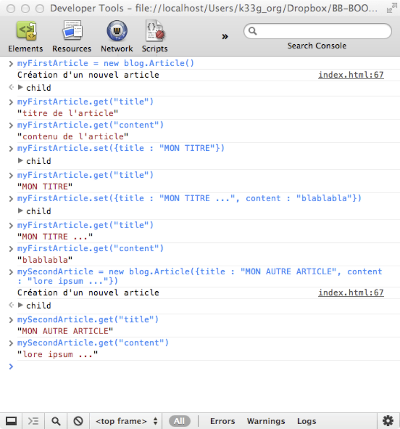
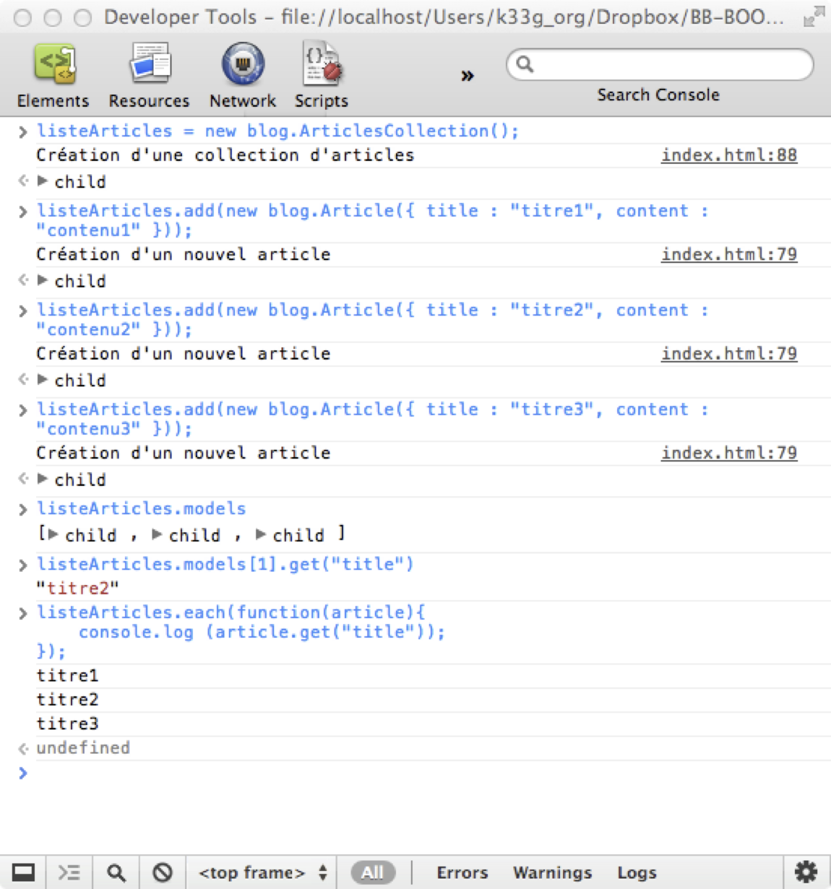
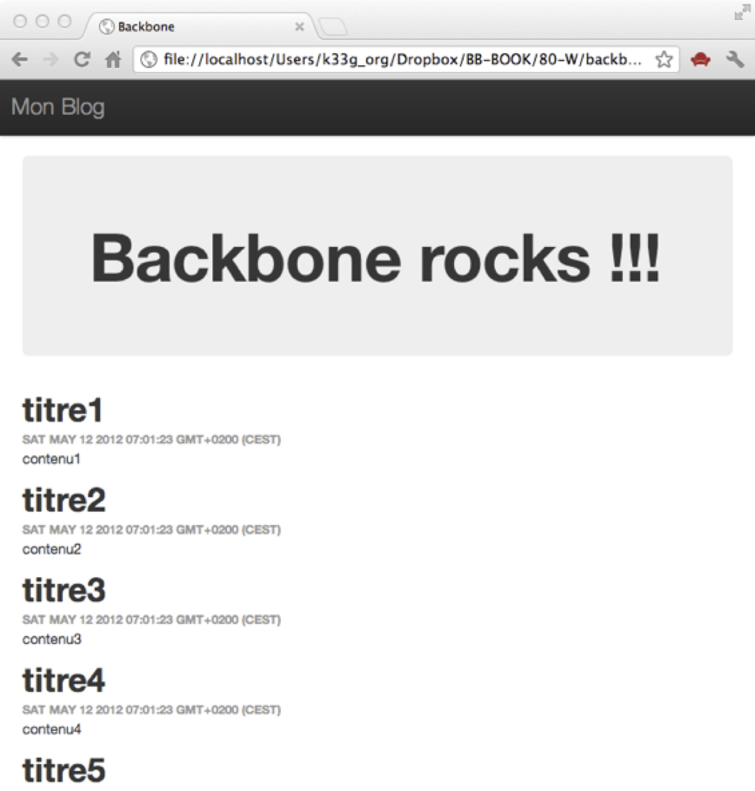
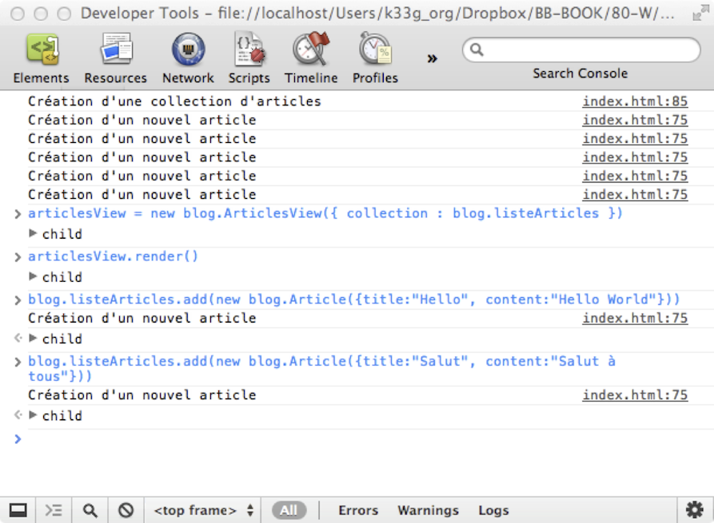
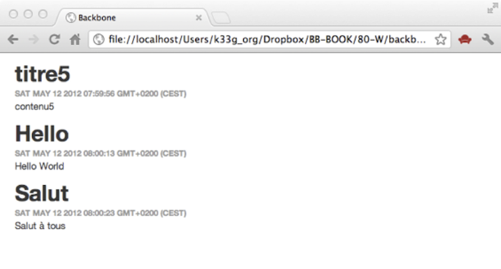

#1er contact … avec Backbone

>*Sommaire*

>>- *Premier modèle*
>>- *Première collection*
>>- *Première vue & premier template*


>*Nous allons faire un premier exemple Backbone pas à pas, même sans connaître le framework. Cela va permettre de « désacraliser » la bête et de mettre un peu de liant avec tout ce que nous avons vu précédemment. Puis nous passerons dans le détail tous les composants de Backbone dans les chapitres qui suivront.*

Voilà, il est temps de s'y mettre. L'application que nous allons réaliser avec Backbone tout au long de cet ouvrage va être un blog, auquel nous ajouterons au fur et à mesure des fonctionnalités pour finalement le transformer en CMS (Content Management System). Je vous l'accorde ce n'est pas très original, mais cela répond à des problématiques classiques (récurrentes ?) dans notre vie "d'informaticien" et cela a le mérite d'avoir un aspect pratique et utile. Notre point de départ va être un blog que nous agrémenterons de fonctionnalités au fil des chapitres.

##1ère application Backbone

Nous allons faire ici un exemple très rapide, sans forcément entrer dans le détail ni mettre en œuvre les bonnes pratiques d'organisation de code. Cet exercice est là pour démontrer la simplicité d'utilisation, et le code devrait être suffisamment simple pour se passer d'explications. Donc, "pas de panique !", laissez-vous guider, dans **15 minutes** vous aurez une 1ère ébauche.

###Préparons notre page

Nous allons utiliser notre même page `index.html`, mais faisons un peu de ménage à l'intérieur avant de commencer :

```html
<!DOCTYPE html>
<html>
  <head>
    <meta http-equiv="Content-Type" content="text/html; charset=utf-8">
    <title>Backbone</title>
	<meta name="viewport" content="width=device-width, initial-scale=1.0">
    <!--V 3.0.1 ...-->
    <link href="libs/vendors/bootstrap/css/bootstrap.css" rel="stylesheet">
    <link href="libs/vendors/bootstrap/css/bootstrap-theme.css" rel="stylesheet">

    <style>
      body {
        padding-top: 60px;
        padding-bottom: 40px;
      }
    </style>

  </head>

  <body>
    <div class="navbar navbar-inverse navbar-fixed-top">
        <div class="navbar-header">
            <div class="container">
                <a class="navbar-brand">Mon Blog</a>
            </div>
        </div>
    </div>

    <div class="container">

      <div class="jumbotron">
        <h1>Backbone rocks !!!</h1>
      </div>


    </div>

  </body>
  <!-- === Références aux Frameworks === -->
  <script src="libs/vendors/jquery.js"></script><!--V 1.10.2 -->
  <script src="libs/vendors/underscore.js"></script><!--V 1.5.2 -->
  <script src="libs/vendors/backbone.js"></script><!--V 1.1.0 -->

  <script>
      $(function (){

      });
  </script>
</html>
```

L'essentiel de notre travail va se passer dans la balise `<script></script>` en bas de page. De quoi avons-nous besoin dans un blog ?

- Des articles : un ensemble d'articles (ou "posts"), généralement écrits par une seule personne (le blog est personnel, c'est en lui donnant des fonctionnalités multi-utilisateurs que nous nous dirigerons doucement vers un CMS).
- Des commentaires : Il est de bon ton de permettre aux lecteurs du blog de pouvoir commenter les articles.

Pour le moment nous allons nous concentrer uniquement sur les articles, notre objectif sera le suivant : "Afficher une liste d'articles sur la page principale".


##Le Modèle “Article”

Dans la balise `<script></script>` saisissez le code suivant :

*Définition d’un modèle Article :*

```html
<script>

$(function() {
  //permettra d'accéder à nos variables en mode console
  window.blog = {};

  /*--- Modèle article ---*/

  // une "sorte" de classe Article
  blog.Article = Backbone.Model.extend({
    //les valeurs par défaut d'un article
    defaults: {
      title: "titre de l'article",
      content: "contenu de l'article",
      publicationDate: new Date()
    },
    // s'exécute à la création d'un article
    initialize: function() {
      console.log("Création d'un nouvel article")
    }
  });

});

</script>
```

Sauvegardez, relancez dans le navigateur et allez dans la console :

- Pour créer un nouvel article : tapez la commande `myFirstArticle = new blog.Article()`
- Pour "voir" le titre de l'article : tapez la commande `myFirstArticle.get("title")`
- Pour "voir" le contenu de l'article : tapez la commande `myFirstArticle.get("content")`
- Pour changer le titre de l'article : tapez la commande `myFirstArticle.set("title","MON TITRE")` ou `myFirstArticle.set({title : "MON TITRE"})`
- Pour changer simultanément le titre et le contenu : tapez la commande `myFirstArticle.set({title : "MON TITRE...", content : "blablabla"})`
- Pour créer un article directement avec un titre et du contenu : tapez la commande `mySecondArticle = new blog.Article({title : "MON AUTRE ARTICLE", content : "lorem ipsum..."})`





Vous venez donc de voir que nous avons défini le modèle article “un peu” comme une classe qui hériterait (`extend`) de la classe `Backbone.Model`, que nous lui avons défini des valeurs par défaut (`defaults`), et affecté une méthode d’initialisation (`initialize`). Et qu’il existe un système de getter et de setter un peu particulier (`model.get(property_name)`, `model.set(property_name, value)`), mais nous verrons ultérieurement dans le détail comment fonctionnent les modèles.

>>**Remarque** *: le modèle de programmation de Javascript est bien orienté objet, mais n’est pas orienté “classe” comme peut l’être par exemple Java. Cela peut déstabiliser au départ, mais je vous engage à lire [REF VERS ARTICLE] à ce propos.*

##La Collection d’Articles

Nous allons maintenant définir une collection qui nous aidera à gérer nos articles. Donc, à la suite du modèle Article saisissez le code suivant :

*Définition d’une collection d’articles :*

```javascript
/*--- Collection d'articles ---*/

blog.ArticlesCollection = Backbone.Collection.extend({
  model: blog.Article,
  initialize: function() {
    console.log("Création d'une collection d'articles")
  }
});
```

>>**Notez** *qu'il faut bien préciser le type de modèle associé à la collection (on pourrait dire que la collection est typée).*

Sauvegarder, relancer dans le navigateur, retournez à nouveau dans la console et saisissez les commandes suivantes :

- Création de la collection :

```javascript
listeArticles = new blog.ArticlesCollection()
```

- Ajout d’articles à la collection :

```javascript
listeArticles.add(new blog.Article({ title : "titre1", content : "contenu1" }))
listeArticles.add(new blog.Article({ title : "titre2", content : "contenu2" }))
listeArticles.add(new blog.Article({ title : "titre3", content : "contenu3" }))
```
Nous venons donc d'ajouter 3 articles à notre collection,

- Si vous tapez la commande `listeArticles.models` vous obtiendrez un tableau de modèles
- Si vous souhaitez obtenir le titre du 2ème article de la collection, tapez :

  `listeArticles.models[1].get("title")`

- vous souhaitez parcourir les articles de la collection et afficher leur titre :

  `listeArticles.each(function(article){ console.log (article.get("title")); });`

>>Cela vous rappelle quelque chose ? Le `each` de Backbone est implémenté grâce à Underscore.





**Maintenant que nous avons de quoi gérer nos données, il est temps de les afficher dans notre page HTML.**

##Vue et Template

Avant toute chose, allons ajouter dans notre code javascript (en bas de la page HTML) le bout de code qui va créer les articles et la collection d'articles pour nous éviter de tout re-saisir à chaque fois. Donc après le code de la collection, ajoutez ceci :

```javascript
/*--- bootstrap ---*/
blog.listeArticles = new blog.ArticlesCollection();

blog.listeArticles.add(new blog.Article({ title : "titre1", content : "contenu1" }));
blog.listeArticles.add(new blog.Article({ title : "titre2", content : "contenu2" }));
blog.listeArticles.add(new blog.Article({ title : "titre3", content : "contenu3" }));
blog.listeArticles.add(new blog.Article({ title : "titre4", content : "contenu4" }));
blog.listeArticles.add(new blog.Article({ title : "titre5", content : "contenu5" }));
```

Ensuite dans le code html, ajoutons le template de notre vue et le div dans lequel les données seront affichées :

```html
<% _.each(articles, function(article) { %>
<h1><%= article.title %></h1>
<h6><%= article.publicationDate %></h6>
<p><%= article.content %></p>
<% }); %>
```

donc :

```html
<body>

  <div class="navbar navbar-inverse navbar-fixed-top">
    <div class="navbar-header">
        <div class="container">
            <a class="navbar-brand">Mon Blog</a>
        </div>
    </div>
</div>

  <div class="container">

    <div class="jumbotron">
      <h1>Backbone rocks !!!</h1>
    </div>

    <!-- ìci notre template -->
    <script type="text/template" id="articles-collection-template">

      <% _.each(articles, function(article) { %>
      <h1><%= article.title %></h1>
      <h6><%= article.publicationDate %></h6>
      <p><%= article.content %></p>
      <% }); %>

    </script>
    <!-- les données seront affichées ici -->
    <div id="articles-collection-container"></div>

  </div>

</body>
```

Puis dans le code javascript, à la suite du code de la collection et avant le code de chargement des données (bootstrap), ajoutez le code de la vue Backbone :

```javascript
/*--- Vues ---*/
blog.ArticlesView = Backbone.View.extend({
  el: $("#articles-collection-container"),

  initialize: function() {
    this.template = _.template($("#articles-collection-template").html());
  },

  render: function() {
    var renderedContent = this.template({
      articles: this.collection.toJSON()
    });
    $(this.el).html(renderedContent);
    return this;
  }
});
```

###Qu’avons-nous fait ?

Eh bien, nous avons défini une vue avec :

- Une propriété `el` (pour élément) à laquelle on “attache” le `<div>` dont l’id est : `“articles-collection-container”`. C’est dans ce `<div>` que seront affichés les articles

- Une méthode `initialize`, qui affecte une méthode `template()` à l’instance de la vue en lui précisant que nous utiliserons le modèle de code html définit dans le `<div>` dont l’id est `“articles-collection-template”`
- Une méthode `render`, qui va passer les données en paramètre à la méthode `template()` puis les afficher dans la page

Sauvegarder, relancer dans le navigateur et retournez encore dans la console pour saisir les commandes suivantes :

- Pour instancier une vue : `articlesView = new blog.ArticlesView({ collection : blog.listeArticles })` à laquelle nous passons la collection d’articles en paramètre
- Pour afficher les données : `articlesView.render()`

**Et là, la "magie" de Backbone opère, vos articles s'affichent instantanément dans votre page :** :)





>>**Remarque** : Notez bien que la collection doit être transformée en chaîne JSON pour être interprétée dans le template ( `this.template({ articles : this.collection.toJSON() })` ) et que nous avons nommé le paramètre `articles` pour faire le lien avec le template ( `_.each(articles, function(article) {}` ).

##Un dernier tour de magie pour clôturer le chapitre d’initiation : “binding”

A la fin de la méthode `initialize` de la vue, ajoutez le code suivant :

```javascript
/*--- binding ---*/
_.bindAll(this, 'render');

this.collection.bind('change', this.render);
this.collection.bind('add', this.render);
this.collection.bind('remove', this.render);
/*---------------*/
```

###Que venons-nous de faire ?

Nous venons "d'expliquer" à Backbone, qu'à chaque changement dans la collection, la vue doit rafraîchir son contenu. `_.bindAll` est une méthode d'Underscore ([http://documentcloud.github.com/underscore/#bindAll](http://documentcloud.github.com/underscore/#bindAll)) qui permet de conserver le contexte initial, c'est à dire : quel que soit "l'endroit" d'où l'on appelle la méthode `render`, ce sera bien l'instance de la vue (attachée à `this`) qui sera utilisée.

  //TODO: à expliquer plus simplement

Une dernière fois, sauvegarder, relancer le navigateur et retournez encore dans la console pour saisir les commandes suivantes :

- Création de la vue : `articlesView = new blog.ArticlesView({ collection : blog.listeArticles })`
- Afficher les données : `articlesView.render()`
- Ajouter un nouvel article à la collection : `blog.listeArticles.add(new blog.Article({title:"Hello", content:"Hello World"}))`

**Et là, magique ! : L’affichage s'est actualisé tout seul :**


###Oh la vilaine erreur !!!

Si vous avez bien suivi, j'ai fait une grossière erreur (je l’ai laissée volontairement, car c'est une erreur que j'ai déjà faite, et il n'est donc pas impossible que d'autres la fassent), la date de publication ne change pas ! En effet, je l'affecte dans les valeurs par défaut qui ne sont "settées" qu'une seule et unique fois lors de la définition de la "pseudo" classe `Backbone.Model`. Il faut donc initialiser la date de publication lors de l'instanciation du modèle, et ce dans la méthode `initialize()`. Modifiez donc le code du modèle de la manière suivante :

```javascript
/*--- Modèle article ---*/

blog.Article = Backbone.Model.extend({ // une "sorte" de classe Article
  defaults: { //les valeurs par défaut d'un article
    title: "titre de l'article",
    content: "contenu de l'article",
    //publicationDate : null
  },
  initialize: function() { // s'exécute à la création d'un article
    console.log("Création d'un nouvel article");
    this.set("publicationDate", new Date());
  }
});
```

Refaites les manipulations précédentes, et là (si vous avez laissez suffisamment de temps entre la création des articles), vous pourrez noter que la date est bien mise à jour :







>>**Remarque** : la propriété date n’existe plus dans les valeurs par défaut, elle est créée à l’instanciation du modèle lors de l’appel de `this.set("publicationDate",new Date())` dans la méthode `initialize`. De la même manière, vous pouvez créer à la volée des propriétés _a posteriori_ pour les instances des modèles.

**Et voilà, l’initiation est terminée. Nous allons pouvoir passer “aux choses sérieuses” et découvrir jusqu’où nous pouvons “pousser” Backbone.**

##Code final de l'exemple

Le code final de votre page devrait ressembler à ceci :

```html
<!DOCTYPE html>
<html>
  <head>
    <meta http-equiv="Content-Type" content="text/html; charset=utf-8">
    <title>Backbone</title>
	<meta name="viewport" content="width=device-width, initial-scale=1.0">
    <!--V 3.0.1 ...-->
    <link href="libs/vendors/bootstrap/css/bootstrap.css" rel="stylesheet">
    <link href="libs/vendors/bootstrap/css/bootstrap-theme.css" rel="stylesheet">
    
    <style>
      body {
        padding-top: 60px;
        padding-bottom: 40px;
      }
    </style>
    
  </head>

  <body>

    <div class="navbar navbar-inverse navbar-fixed-top">
        <div class="navbar-header">
            <div class="container">
                <a class="navbar-brand">Mon Blog</a>
            </div>
        </div>
    </div>

    <div class="container">

      <div class="jumbotron">
        <h1>Backbone rocks !!!</h1>
      </div>

      <!-- Template d'affichage des articles -->
      <script type="text/template" id="articles-collection-template">

        <% _.each(articles, function(article) { %>
        <h1><%= article.title %></h1>
        <h6><%= article.publicationDate %></h6>
        <p><%= article.content %></p>
        <% }); %>

      </script>
      <!-- div où seront affichés les articles -->
      <div id="articles-collection-container"></div>

    </div>

  </body>
  <!-- === Références aux Frameworks === -->
  <script src="libs/vendors/jquery.js"></script><!--V 1.10.2 -->
  <script src="libs/vendors/underscore.js"></script><!--V 1.5.2 -->
  <script src="libs/vendors/backbone.js"></script><!--V 1.1.0 -->

  <!-- === code applicatif === -->
  <script>
  $(function() {
    window.blog = {};

    /*--- Modèle article ---*/

    blog.Article = Backbone.Model.extend({
      defaults: {
        title: "titre de l'article",
        content: "contenu de l'article",
      },
      initialize: function() {
        console.log("Création d'un nouvel article");
        this.set("publicationDate", new Date());
      }
    });

    /*--- Collection d'articles ---*/

    blog.ArticlesCollection = Backbone.Collection.extend({
      model: blog.Article,
      initialize: function() {
        console.log("Création d'une collection d'articles")
      }
    });

    /*--- Vues ---*/
    blog.ArticlesView = Backbone.View.extend({

      el: $("#articles-collection-container"),

      initialize: function() {
        this.template = _.template($("#articles-collection-template").html());

        /*--- binding ---*/
        _.bindAll(this, 'render');

        this.collection.bind('change', this.render);
        this.collection.bind('add', this.render);
        this.collection.bind('remove', this.render);
        /*---------------*/
      },

      render: function() {
        var renderedContent = this.template({
          articles: this.collection.toJSON()
        });
        $(this.el).html(renderedContent);
        return this;
      }
    });

    /*--- bootstrap ---*/
    blog.listeArticles = new blog.ArticlesCollection();

    blog.listeArticles.add(new blog.Article({
      title: "titre1",
      content: "contenu1"
    }));
    blog.listeArticles.add(new blog.Article({
      title: "titre2",
      content: "contenu2"
    }));
    blog.listeArticles.add(new blog.Article({
      title: "titre3",
      content: "contenu3"
    }));
    blog.listeArticles.add(new blog.Article({
      title: "titre4",
      content: "contenu4"
    }));
    blog.listeArticles.add(new blog.Article({
      title: "titre5",
      content: "contenu5"
    }));

  });
  </script>
</html>
```


