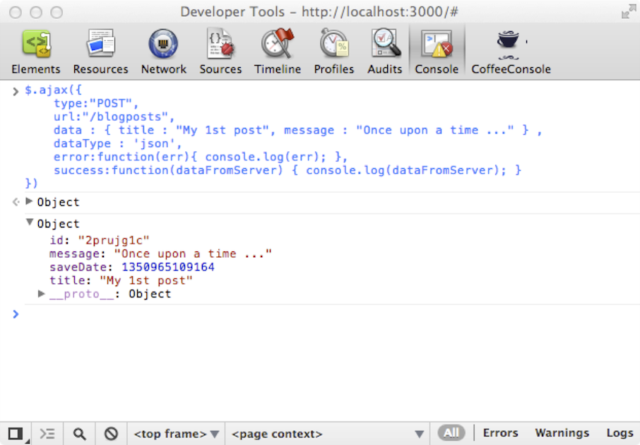
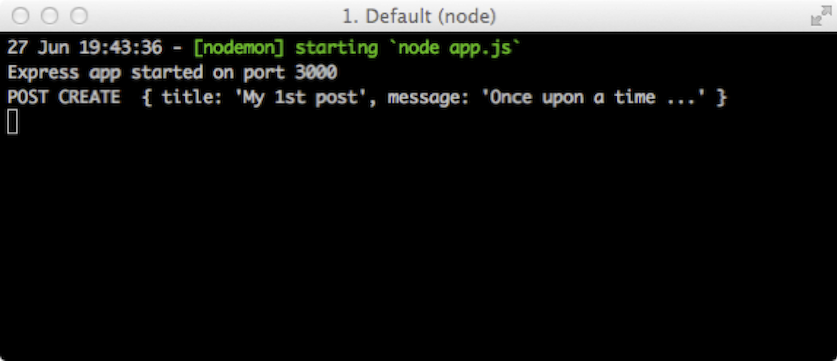
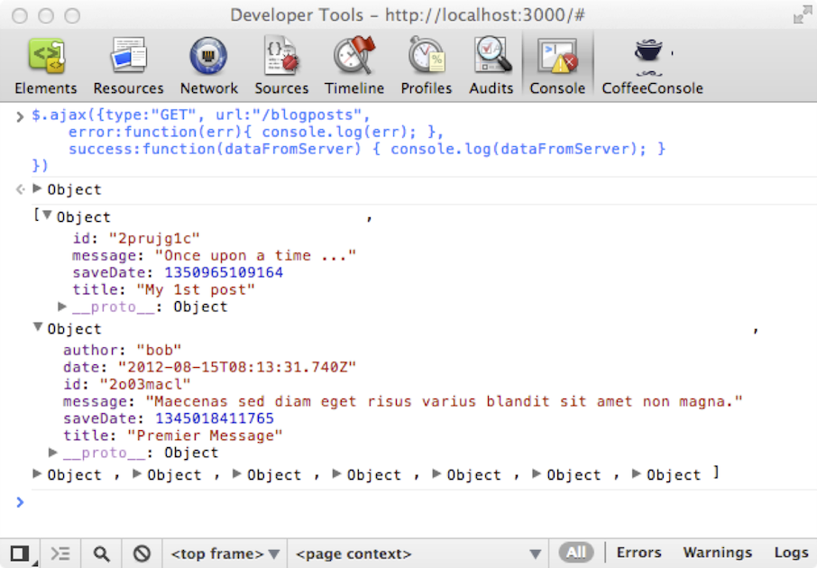
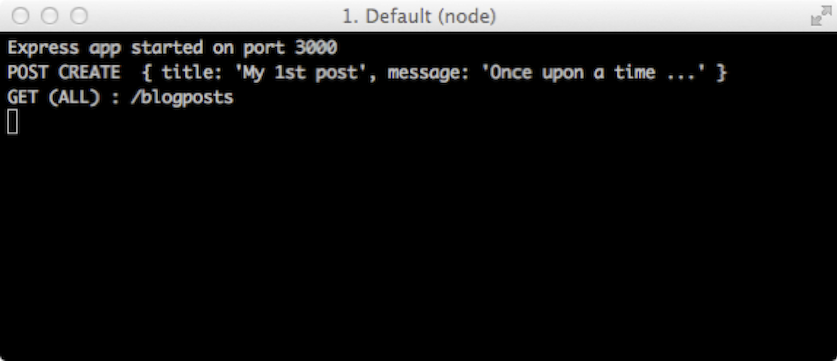
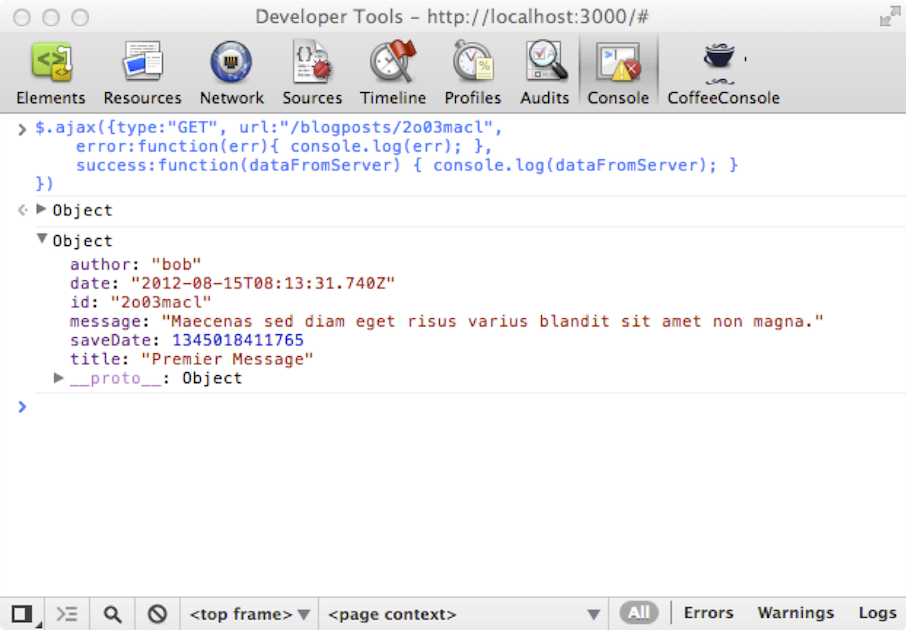
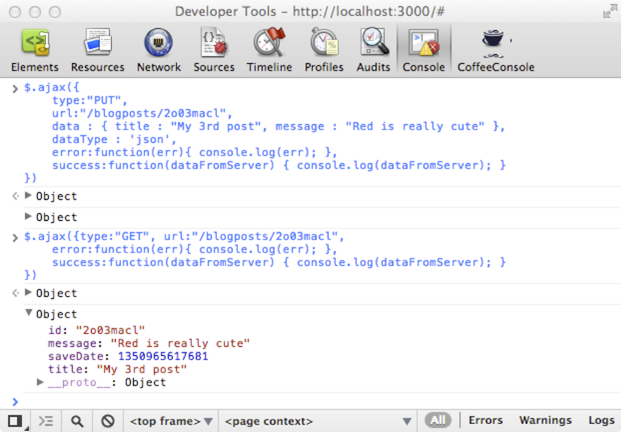
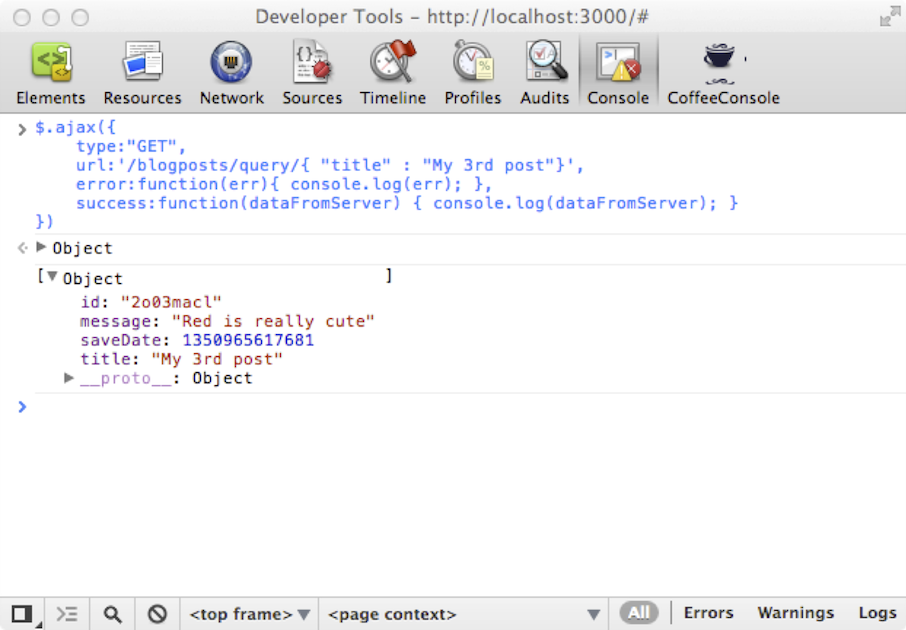
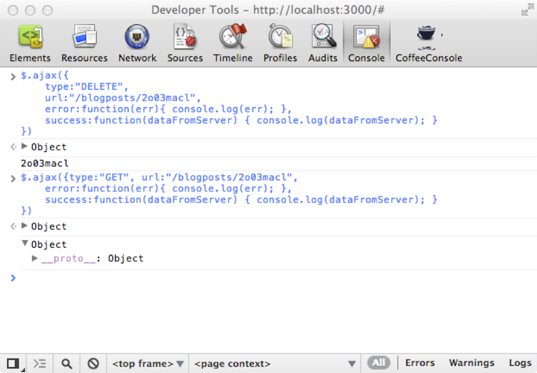

#Il nous faut un serveur !

>*Sommaire*

>>- *Petit rappel sur les requêtes http*
>>- *Installations des composants nécessaires*
>>- *Construction et test de notre serveur d’application*


>*Faisons un dernier détour avant de revenir à Backbone. Pour bien en comprendre le fonctionnement, nous allons nous mettre en situation réelle. Ne laissons pas notre future webapp toute seule. Généralement une application web comporte une partie serveur qui sert à distribuer des données vers l’IHM client (dans le navigateur). Pour que le tour de Backbone.js soit complet, il serait impensable de ne pas étudier les interaction avec un serveur (interrogation de données, Ajax…)*

Pour ce chapitre, je me suis longuement posé la question : «  quelle technologie serveur utiliser ? ». PHP, Ruby, Java, .Net… ? C’était aussi prendre le risque de vous désintéresser complètement. D’un autre côté, je souhaitais que vous puissiez rapidement entrer dans le vif du sujet. J’ai donc finalement choisi de vous faire utiliser Node.js puisque c’est aussi du Javascript et que sa mise en œuvre est rapide sans pour autant être obligé de connaître Node.js dans son ensemble. **Objectif : disposer d’un serveur d’application fournissant des services JSON en moins d’une demi-heure !**

Nous aurons besoin de :

- **Node.js** pour le serveur d’application
- **Express.js** qui va nous permettre de construire notre application (gestion des routes, sessions, etc.)
- **nStore** : une petite base de données noSQL simulée avec un fichier texte (nous n’allons pas nous embêter à faire des requêtes SQL, et le noSQL est à la mode ;) )

##Principes http : GET, POST, PUT, DELETE

Mon but est de faire une application web avec Node & Express sur les principes REST (Representational State Transfer) qui permettra de faire des opérations de type **CRUD** avec les modèles Backbone en utilisant des services basés sur le protocole http avec les verbes suivants :

- **C**reate : POST
- **R**ead : GET
- **U**pdate : PUT
- **D**elete : DELETE

Si cela vous paraît obscur, pas d'inquiétude, la partie pratique qui suit devrait vous éclairer. Mais je vous engage fortement à lire [http://naholyr.fr/2011/08/ecrire-service-rest-nodejs-express-partie-1/](http://naholyr.fr/2011/08/ecrire-service-rest-nodejs-express-partie-1/) de [@naholyr](https://twitter.com/naholyr).

  //TODO: vois si ça nécessite d'être développé

##Installation(s)

###Installer Node.js

Tout d’abord, allez sur le site [http://nodejs.org/](http://nodejs.org/), si vous êtes sous OSX ou Windows, vous avez de la chance, il existe des installeurs tout prêts, si vous êtes sous Linux, les manipulations ne sont pas compliquées, je vous engage à lire ceci : [https://github.com/joyent/node/wiki/Installing-Node.js-via-package-manager](https://github.com/joyent/node/wiki/Installing-Node.js-via-package-manager).
Une fois les installeurs utilisés (ou les manipulations Linux) vous disposerez de Node.js ainsi que du gestionnaire de paquets NPM qui va nous permettre d’installer de nombreux modules pour Node.js.

###Installer Express.js

Express.js est un framework qui se greffe sur Node.js et vous permet de réaliser rapidement des applications web, en vous apportant quelques facilités comme la gestion des routes, des sessions, etc.

Commençons à créer notre application serveur. Créez un répertoire `blog` sur votre disque dur.
Quel que soit votre système d’exploitation, ouvrez une console ou un terminal et tapez les commandes suivantes (et validez):

```
  cd blog
  npm install express
```

>>**Remarque 1** : sous OSX ou linux vous devrez probablement passer en mode super utilisateur, faites donc précéder la commande par `sudo` : `sudo npm install express`

Nous venons donc d'installer le module **express** dans notre répertoire `blog`.

>>**Remarque 2** : il y a d'autres méthodes pour créer une application avec express, mais dans notre cas j'ai besoin du strict minimum.


###Installer nStore

Nous aurons besoin d’un moyen de sauvegarder de nos données. Pour cela nous allons utiliser **nStore** qui est une sorte de base de données NoSQL clé/valeur pour node.js (il existe de nombreuses autres solutions telles MongoDB, CouchDB, des bases de donnée relationnelles… mais ce n’est pas l’objet de cet ouvrage).
Pour installer nStore (toujours dans le répertoire `blog`) tapez la commande suivante :

```
  npm install nstore
```

>>**Remarque** : vous pouvez noter maintenant la présence d’un répertoire `node_modules` dans `blog`, contenant lui-même deux sous-répertoires `express` et `nstore`.

Voilà, nous avons tout ce qu'il faut pour commencer à créer notre application.

##Codons notre application serveur

Notre application se découpe en 2 parties :

- une partie statique, c'est là que viendra tout ce "qui touche" à Backbone
- une partie dynamique, notre serveur, ce sera notre "fournisseur" de données

###Ressources statiques

Tout d’abord vous devez créer un sous-répertoire `public`, où nous allons copier les ressources statiques de notre application. Pour cela, utilisez les fichiers dont nous nous sommes servis pour notre exemple de découverte, et copiez les fichiers ci-dessous dans le répertoire `public` :

- `libs/vendors/backbone.js`
- `libs/vendors/underscore.js`
- `libs/vendors/jquery-1.7.2.js` *(ou une version plus récente)*

Et copiez aussi le répertoire `bootstrap` de notre exemple. Ensuite, préparez une page `index.html` dans le répertoire `public`, avec le code suivant :

```html
<!DOCTYPE html>
<html>
  <head>
    <meta http-equiv="Content-Type" content="text/html; charset=utf-8">
    <title>Backbone</title>
	<meta name="viewport" content="width=device-width, initial-scale=1.0">
    <!--V 3.0.1 ...-->
    <link href="libs/vendors/bootstrap/css/bootstrap.css" rel="stylesheet">
    <link href="libs/vendors/bootstrap/css/bootstrap-theme.css" rel="stylesheet">
    <style>
      body {
        padding-top: 60px;
        padding-bottom: 40px;
      }
    </style>
  </head>

  <body>

    <div class="navbar navbar-inverse navbar-fixed-top">
        <div class="navbar-header">
            <div class="container">
                <a class="navbar-brand">Mon Blog</a>
            </div>
        </div>
    </div>

    <div class="container">
      <div class="jumbotron">
        <h1>Backbone rocks !!!</h1>
      </div>

    </div>

  </body>
  <!-- === Références aux Frameworks === -->
  <script src="libs/vendors/jquery.js"></script><!--V 1.10.2 -->
  <script src="libs/vendors/underscore.js"></script><!--V 1.5.2 -->
  <script src="libs/vendors/backbone.js"></script><!--V 1.1.0 -->

  <!-- === code applicatif === -->
  <script>
  </script>
</html>
```

###Ressources dynamiques

Toujours dans le répertoire `public`, créez un fichier `app.js` qui sera le programme principal de notre application et qui contiendra le code suivant :

>>**Remarque** : ce n’est pas grave si vous ne comprenez pas le code à ce stade, l’important c’est que cela fonctionne. Mais vous allez voir, à l’utilisation « tout s’éclaire ».

Rapidement, le code serveur comporte :

- l'initialisation de la base de données des posts et celle des users
- 6 routes :

  - `'/blogposts'` (`GET`) : pour récupérer tous les posts du blog
  - `'/blogposts/query/:query'` (`GET`) : pour récupérer certains posts du blog
  - `'/blogposts/:id'` (`GET`) : pour récupérer un post
  - `'/blogposts` (`POST`) : pour créer un nouveau post
  - `'/blogposts/:id'` (`PUT`) : pour modifier un post existant
  - `'/blogposts/:id'` (`DELETE`) : pour supprimer un post

```javascript
/*--------------------------------------------
Déclaration des librairies
--------------------------------------------*/
var express = require('express'),
  nStore = require('nstore'),
  app = module.exports = express();

nStore = nStore.extend(require('nstore/query')());

/*--------------------------------------------
Paramétrages de fonctionnement d'Express
--------------------------------------------*/
app.use(express.json());
app.use(express.urlencoded());
app.use(express.methodOverride());
app.use(express.static(__dirname + '/public'));
app.use(express.cookieParser('ilovebackbone'));
app.use(express.session({
  secret: "ilovebackbone"
}));

/*--------------------------------------------
Définition des "bases" posts & users
--------------------------------------------*/
var posts, users;

posts = nStore.new("blog.db", function() {
  users = nStore.new("users.db", function() {
    /*
      une fois les bases ouvertes, on passe
      en attente de requête http (cf. code de
      la fonction Routes())
      Si les bases n'existent pas,
      elles sont crées automatiquement
    */
    Routes();
    app.listen(3000);
    console.log('Express app started on port 3000');

  });
});

function Routes() {
  /*
    Obtenir la liste de tous les posts lorsque
    l'on appelle http://localhost:3000/blogposts
    en mode GET
  */
  app.get('/blogposts', function(req, res) {
    console.log("GET (ALL) : /blogposts");
    posts.all(function(err, results) {
      if (err) {
        console.log("Erreur : ", err);
        res.json(err);
      } else {
        var posts = [];
        for (var key in results) {
          var post = results[key];
          post.id = key;
          posts.push(post);
        }
        res.json(posts);
      }
    });
  });

  /*
    Obtenir la liste de tous les posts correspondant à un critère
    lorsque l'on appelle http://localhost:3000/blogposts/query/ en
    mode GET avec une requête en paramètre
    ex : query : { "title" : "Mon 1er post"} }
  */
  app.get('/blogposts/query/:query', function(req, res) {
    console.log("GET (QUERY) : /blogposts/query/" + req.params.query);

    posts.find(JSON.parse(req.params.query), function(err, results) {
      if (err) {
        console.log("Erreur : ", err);
        res.json(err);
      } else {
        var posts = [];
        for (var key in results) {
          var post = results[key];
          post.id = key;
          posts.push(post);
        }
        res.json(posts);
      }
    });

  });

  /*
    Retrouver un post par sa clé unique lorsque
    l'on appelle http://localhost:3000/blogposts/identifiant_du_post
    en mode GET
  */

  app.get('/blogposts/:id', function(req, res) {
    console.log("GET : /blogposts/" + req.params.id);
    posts.get(req.params.id, function(err, post, key) {
      if (err) {
        console.log("Erreur : ", err);
        res.json(err);

      } else {
        post.id = key;
        res.json(post);
      }
    });
  });

  /*
    Créer un nouveau post lorsque
    l'on appelle http://localhost:3000/blogpost
    avec en paramètre le post au format JSON
    en mode POST
  */
  app.post('/blogposts', function(req, res) {
    console.log("POST CREATE ", req.body);

    var d = new Date(),
      model = req.body;
    model.saveDate = (d.valueOf());

    posts.save(null, model, function(err, key) {
      if (err) {
        console.log("Erreur : ", err);
        res.json(err);
      } else {
        model.id = key;
        res.json(model);
      }
    });
  });


  /*
    Mettre à jour un post lorsque
    l'on appelle http://localhost:3000/blogpost
    avec en paramètre le post au format JSON
    en mode PUT
  */
  app.put('/blogposts/:id', function(req, res) {
    console.log("PUT UPDATE", req.body, req.params.id);

    var d = new Date(),
      model = req.body;
    model.saveDate = (d.valueOf());

    posts.save(req.params.id, model, function(err, key) {
      if (err) {
        console.log("Erreur : ", err);
        res.json(err);
      } else {
        res.json(model);
      }
    });
  });

  /*
    supprimer un post par sa clé unique lorsque
    l'on appelle http://localhost:3000/blogpost/identifiant_du_post
    en mode DELETE
  */
  app.delete('/blogposts/:id', function(req, res) {
    console.log("DELETE : /delete/" + req.params.id);

    posts.remove(req.params.id, function(err) {
      if (err) {
        console.log("Erreur : ", err);
        res.json(err);
      } else {
        //petit correctif de contournement (bug ds nStore) :
        //ré-ouvrir la base lorsque la suppression a été faite
        posts = nStore.new("blog.db", function() {
          res.json(req.params.id);
          //Le modèle est vide si on ne trouve rien
        });
      }
    });
  });
}
```

Maintenant, nous allons faire un dernier travail avant de revenir à Backbone : Nous allons vérifier que notre serveur d’application fonctionne. Pour le lancer : en mode console, allez dans le répertoire `blog` et lancez la commande `node app.js `.

>>**Astuce :** plutôt que de devoir arrêter et relancer votre application à chaque modification, installez **nodemon** : `npm install -g nodemon`, dorénavant pour lancer votre application web, tapez `nodemon app.js` au lieu de `node app.js`, et elle se relancera toute seule à chaque fois que nodemon détectera un changement dans vos fichiers (au moment de la sauvegarde).

##Testons notre application serveur

Une fois notre application lancée, ouvrez un navigateur, appelez l’url [http://localhost:3000](http://localhost:3000) et ouvrez la console de debug du navigateur. Et c'est parti pour les tests, où nous allons utiliser intensivement les fonctionnalité Ajax de jQuery. Rappelez vous, nous l'avons inclus(e) dans notre projet, via notre page `index.html`, et au début de notre code dans `app.js`, nous avons la ligne suivante : `app.use(express.static(__dirname + '/public'));`, donc si à l'appel de [http://localhost:3000](http://localhost:3000), le serveur ne trouve pas de route `"/"`, il nous dirigera directement vers `index.html`.

###Ajoutons un enregistrement

Dans la console tapez ceci (et validez) :

*Requête http de type POST :*

```javascript
$.ajax({
  type: "POST",
  url: "/blogposts",
  data: {
    title: "My 1st post",
    message: "Once upon a time..."
  },
  dataType: 'json',
  error: function(err) {
    console.log(err);
  },
  success: function(dataFromServer) {
    console.log(dataFromServer);
  }
})
```

Vous venez donc de créer votre tout 1er post (vous avez appelé la route `'/blogposts'` de type `POST`), et vous devriez obtenir ceci dans la console du navigateur :




Vous noterez que vous obtenez en retour le numéro de clé unique de votre enregistrement (généré par la base nStore) et aussi une date de sauvegarde. **Renouvelez l’opération plusieurs fois pour ajouter plusieurs enregistrements** *(si, si, faites-le)*.
De même dans le terminal, vous noterez l’apparition du message `POST CREATE`, nous avons donc bien appelé la “route” `/blogposts` de type `POST` :




###Obtenir tous les enregistrements

Dans la console, tapez ceci :

*Requête http de type GET :*

```javascript
$.ajax({
  type: "GET",
  url: "/blogposts",
  error: function(err) {
    console.log(err);
  },
  success: function(dataFromServer) {
    console.log(dataFromServer);
  }
})
```

Vous obtenez un tableau d’objets correspondant à nos enregistrements :




De même dans le terminal, vous noterez l’apparition du message `GET (ALL)`, nous avons donc bien appelé la “route” `/blogposts` de type `GET` :




###Retrouver un enregistrement particulier (par sa clé)

Dans la console, tapez ceci (vous remarquerez que j’utilise une des clés d’enregistrement):

*Requête http de type GET :*

```javascript
$.ajax({
  type: "GET",
  url: "/blogposts/2o03macl",
  error: function(err) {
    console.log(err);
  },
  success: function(dataFromServer) {
    console.log(dataFromServer);
  }
})
```

Vous obtenez :




De même dans le terminal, vous obtiendrez le message `GET : /blogposts/2o03macl`, nous avons donc bien appelé la “route” `/blogposts` de type `GET` avec la clé du modèle en paramètre.

###Mettre à jour un enregistrement

Dans la console, tapez ceci :

*Requête http de type PUT :*

```javascript
$.ajax({
  type: "PUT",
  url: "/blogposts/2o03macl",
  data: {
    title: "My 3rd post",
    message: "Red is really cute"
  },
  dataType: 'json',
  error: function(err) {
    console.log(err);
  },
  success: function(dataFromServer) {
    console.log(dataFromServer);
  }
})
```

Puis appelez à nouveau pour vérifier :

*Requête http de type GET :*

```javascript
$.ajax({
  type: "GET",
  url: "/blogposts/2o03macl",
  error: function(err) {
    console.log(err);
  },
  success: function(dataFromServer) {
    console.log(dataFromServer);
  }
})
```

La mise à jour a bien été prise en compte :




De même, vous pouvez vérifier dans le terminal, l’apparition des messages correspondant à chacune de nos requêtes.

###Faire une requête

Dans la console, tapez la commande Ajax ci-dessous *(je veux les posts dont le titre est égal à “My 3rd post”)* :

*Requête http de type GET :*

```javascript
$.ajax({
  type: "GET",
  url: '/blogposts/query/{ "title" : "My 3rd post"}',
  error: function(err) {
    console.log(err);
  },
  success: function(dataFromServer) {
    console.log(dataFromServer);
  }
})
```

Vous obtenez :




Une fois de plus, vous pouvez vérifier dans le terminal, l’apparition du message `GET (QUERY)`, nous avons donc bien appelé la “route” `/blogposts` de type `GET` (avec les paramètres de requête en paramètres).

###Supprimer un enregistrement

Supprimons l'enregistrement qui a la clé d'id égale à `2o03macl` *(chez vous c'est sans doute autre chose)*. Dans la console, tapez ceci :

*Requête http de type DELETE :*

```javascript
$.ajax({
  type: "DELETE",
  url: "/blogposts/2o03macl",
  error: function(err) {
    console.log(err);
  },
  success: function(dataFromServer) {
    console.log(dataFromServer);
  }
})
```

Puis recherchez à nouveau l’enregistrement :

*Requête http de type GET :*

```javascript
$.ajax({
  type: "GET",
  url: "/blogposts/2o03macl",
  error: function(err) {
    console.log(err);
  },
  success: function(dataFromServer) {
    console.log(dataFromServer);
  }
})
```

Vous obtenez un objet vide :



De même dans le terminal, vous noterez l’apparition du message `DELETE` puis `GET`, nous avons donc bien appelé la “route” `/blogpost` de type `DELETE` (puis `GET`) avec la clé du modèle en paramètre. Puis un message d’erreur apparaît car l'enregistrement (post) n’existe plus.

La base de notre application côté serveur est donc posée. Nous la ferons évoluer en fonction de nos besoins. **Maintenant, passons aux choses sérieuses** :-).

>>**Remarque** *: Vous avez remarqué que l’url dans le cas de la création, la sauvegarde, et la suppression d’un modèle, ne changeait pas. Ce qui fait la distinction c’est le verbe http (GET, POST, PUT, DELETE).*


