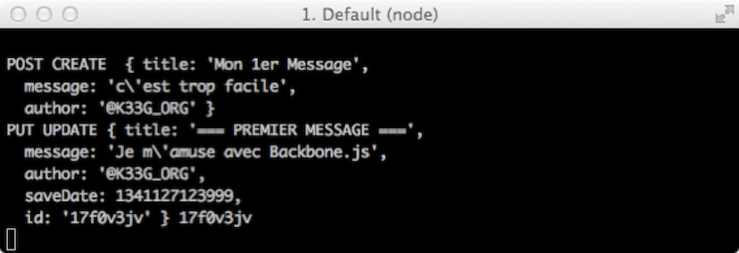

#Les modèles et les collections en détail

>*Sommaire*

>>- *Fonctionnement général*
>>- *Les modèles*
>>- *Les collections*

>*Nous allons voir comment définir nos modèles, jouer avec, interagir avec le serveur. Nous allons étudier l’intérêt d’une collection de modèles. **Attention, pas un gramme d’HTML** (ou presque) dans ce chapitre, nous faisons tout en « mode commande », pour l’HTML il faudra patienter jusqu’au chapitre sur les Vues.*


Dans une application « de gestion », les modèles sont le cœur de l’application, ils représentent des concepts « informatisés » de la « vraie vie » : Les articles d’un catalogue, le client d’une entreprise… Ils peuvent avoir des interactions entre eux : un client a plusieurs factures, la commande d’un fournisseur… Nous avons là 4 modèles : client, facture, fournisseur, commande… sans parler des articles de la facture et de la commande. D’ailleurs en parlant d’article, on pense catalogue et, dans notre cas, le catalogue pourrait être une collection d’articles. Et tout cela doit être sauvegardé, doit pouvoir être retrouvé facilement, etc.  Mais voyons donc le fonctionnement intrinsèque des modèles et collections de Backbone.

##Fonctionnement général

Un modèle Backbone (`Backbone.Model`) représente une entité unique (une instance du modèle), par exemple nous avons la définition du modèle « Client », et si Bob est un client, alors c’est une instance de client. En général, il est lié à une vue (un composant d’affichage) qui changera (modifiera son affichage) lorsque que le modèle changera. Mais les changements du modèle sont aussi synchronisés avec le serveur. La synchronisation avec le serveur se fait avec la méthode `Backbone.sync()`, à chaque fois qu’un modèle fait une opération « CRUD », `Backbone.sync()` est appelée pour « discuter » avec le serveur (pour le moment cela va fonctionner tout seul, mais nous reviendrons plus tard à `Backbone.sync()` pour comprendre son fonctionnement et même modifier celui-ci).


>>**Remarque** : l’acronyme CRUD signifie Create, Read, Update, Delete (Créer, Lire, Mettre à jour, Supprimer). Si vous faites le lien avec le chapitre précédent, lorsque nous allons sauvegarder un nouveau modèle, ce sera une création et une requête de type POST sera envoyée au serveur, dans le cas de la lecture ce sera une requête de type GET, PUT pour les mises à jour de modèles et enfin DELETE pour la suppression. Et c’est la méthode `Backbone.sync()` qui va se charger de faire la bonne requête au serveur en fonction de l’action du modèle.

La collection Backbone (`Backbone.Collection`) sert à stocker (en mémoire) un ensemble de modèles de même type. Elle permettra de les trier par exemple, les filtrer, etc. Elle est aussi généralement liée à une vue et permet de « récupérer » un ensemble de modèles en provenance du serveur. Là encore, c’est `Backbone.sync()` qui s’occupe de faire le travail.

##Modèles

Si vous avez bien suivi les chapitres précédents vous devez disposer d’un squelette d’application à la fois « client » et « serveur ». Nous allons donc dans un premier temps définir notre modèle en javascript, puis nous le manipulerons directement dans la console du navigateur. Vous pouvez d’ores et déjà lancer la partie serveur avec la commande `node app.js` (ou `nodemon app.js`).

###Définition du modèle

Ouvrez la page `index.html` du répertoire `public` et à l’intérieur de la fonction de chargement (`$(function(){})`) vous allez saisir le code de votre premier modèle :

```javascript
$(function() {
  window.Post = Backbone.Model.extend({
    urlRoot: "/blogposts"
  });
});
```

Cela fait peu de code mais nous avons déjà une « mécanique utilisable » avec un grand nombre de possibilités. Nous avons donc un modèle `Post` pour lequel nous avons juste précisé l’url (`urlRoot`) à appeler (par `Backbone.sync`) lors d’actions/traitements de type « CRUD ». En effet un modèle « arrive » avec entre autres les méthodes suivantes : `save` (pour créer et sauvegarder), `fetch` (pour lire des données en provenance du serveur) et `destroy` (pour supprimer le modèle du serveur).

>>**Remarque** : j'ai préfixé `Post` par `window` pour y avoir accès en tant que variable globale (dans ma console par exemple).

Nous n’avons pas défini de « champs » comme on peut le faire en java, nous allons voir qu’il existe diverses manières de le faire.

Lancez votre navigateur et connectez-vous sur [http://localhost:3000](http://localhost:3000) (la page `index.html` est chargée par défaut si on ne le précise pas) et ouvrez votre console (celle du navigateur).

Puis saisissez ceci dans la console (et validez) :

*Nouvelle instance d'un modèle "Post" :*

```javascript
var message = new Post({
  title: "Premier Message",
  message: "Apprendre Backbone, c'est facile",
  author: "@K33G_ORG"
});
```

Nous avons maintenant une instance d’un modèle, jouons avec. Vous avez noté que la définition des champs du modèle (`title, message, author`) se fait à l’instanciation du modèle, personnellement je trouve cela pratique et très lisible (un début programmation fonctionnelle), mais je comprends que cela puisse perturber (nous verrons comment faire autrement si vous le souhaitez).

>>**Remarque (importante)** : la propriété `urlRoot` du modèle n’est utile que si l’on se « sert » d’un modèle hors d’une collection de modèles (le modèle est indépendant), sinon, si le modèle appartient à une collection et qu’il n’a pas de propriété `urlRoot` renseignée, il « utilise » la propriété `url` de la collection à laquelle il appartient.

###Getters et Setters

Pour lire ou modifier les valeurs des propriétés de notre message, le réflexe serait, par exemple pour obtenir la valeur du titre, de taper la commande `message.title`, et bien cela ne fonctionne pas ! Backbone a une mécanique différente, si vous souhaitez obtenir la valeur du titre il faudra taper la commande `message.get("title")` et pour la modifier `message.set("title", "mon nouveau titre")` ou `message.set({title : "mon nouveau titre"})`, cette dernière notation permet de changer plusieurs propriétés en une seule passe. Cela peut surprendre mais l’utilisation de méthodes plutôt qu’une simple affectation offre beaucoup d’avantages : on peut ainsi s’abonner aux changements des valeurs pour déclencher automatiquement un traitement (comme le rafraîchissement d’une vue par exemple). Faites donc l’exercice dans la console :


###Structure d'un modèle

Mais allons voir comment est structuré un modèle : dans la console, tapez `message` (notre instance de modèle `Post`) et déroulez la structure « child » (child pour instance de modèle) :


Vous notez que les propriétés de notre modèle sont contenues dans un objet `attributes` (c’est pour cela que nous n’y avons pas accès directement et que l'on utilise `get` et `set`).


###Méthodes “CRUD” du modèle

####Méthode save() : création & mise à jour

Saisissez le code javascript ci-dessous dans la console du navigateur. Cela va déclencher une requête ajax vers le serveur pour sauvegarder votre modèle (instance de modèle). Si tout se passe bien, c’est la méthode `success()` qui est appelée.

*Appel de la méthode save() du modèle :*

```javascript
message.save({}, {
  success: function() {
    console.log("message sauvegardé.");
  },
  error: function() {
    console.log("oupss");
  }
});
```


Vous pouvez noter au passage que côté serveur, c’est bien une méthode de type POST qui a été faite et qu’un modèle a été créé en base de données.


Si dans la console du navigateur, vous saisissez `message` (notre modèle) et validez, vous aurez l’opportunité de pouvoir dérouler l’ensemble des membres (propriétés et méthodes) de message. Vous noterez l’apparition de la propriété `id`, avec une valeur (valeur unique qui a été affectée par le serveur).


Modifions maintenant le modèle en cours et sauvegardons le :

*Appel de la méthode save() du modèle :*

```javascript
message.save({
    title   : "=== PREMIER MESSAGE ===",
    message : "Je m'amuse avec Backbone.js"
  }, {
  success: function() {
    console.log("message sauvegardé.");
  },
  error: function() {
    console.log("oupss");
  }
});
```

Ce qui est équivalent à ceci (nous avons juste utilisé un raccourci) :

```javascript
message.set({
  title   : "=== PREMIER MESSAGE ===",
  message : " Je m 'amuse avec Backbone.js"
});
message.save({},{
  success: function() {
    console.log("message sauvegardé.");
  },
  error: function() {
    console.log("oupss");
  }
});
```

Et vous obtiendrez :


Cette fois ci, côté serveur, la requête Ajax a été détectée comme une requête de type `PUT`, donc une requête de mise à jour du modèle.





####Méthode fetch() : retrouver un modèle

Notez bien le numéro d’id affecté par le serveur (dans notre exemple : “17f0v3jv”, attention c’est une valeur aléatoire unique affectée par le serveur) et rafraîchissez votre page dans le navigateur (le modèle `message` disparaît donc de la mémoire).

Créons maintenant une nouvelle fois un modèle avec simplement comme champ, un id prenant la valeur de la clé du modèle sauvegardé en base :

```javascript
var message = new Post({
  id: "17f0v3jv"
});
```

Puis appelons à nouveau la méthode `fetch()` du modèle :

*Appel de la méthode fetch() pour charger les données du serveur :*

```javascript
message.fetch({
  success: function(model) {
    console.log("message retrouvé.");
    console.log(model.get("title"), model.get("message"));
    console.log(message.get("title"), message.get("message"));
  },
  error: function() {
    console.log("oupss");
  }
});
```

Nous récupérons bien les données du modèle sauvegardé :


Et côté serveur, on peut vérifier le message affiché dans le terminal : nous avons bien une requête de type `GET` avec en paramètre la clé unique (identifiant) du modèle.

####Méthode destroy() : supprimer un modèle du serveur

Le principe est le même que pour la méthode `fetch()`, à partir d’un modèle en cours d’utilisation ou un nouveau modèle créé avec un id existant, il suffit ensuite d’appeler la méthode `destroy()` du modèle pour le supprimer de la base de données :

*Appel de la méthode destroy() :*

```javascript
var message = new Post({
  id: "17f0v3jv"
});
message.destroy({
  success: function() {
    console.log("supprimé");
  }
})
```


Et côté serveur, nous avons bien une requête de type `DELETE` avec en paramètre la clé unique (identifiant) du modèle :


###Événements

Il est possible de “s’abonner” aux changements effectués sur un modèle grâce à la méthode `on()` (anciennement `bind()`) de l’instance du modèle :

*Abonnement à un événement avec la méthode on() :*

```javascript
message.on("change", function() {
  console.log("quelque chose a changé");
  if (message.hasChanged("title")) {
    console.log("vous avez changé le titre : ", message.get("title"));
    console.log("l'ancien titre est : ", message.previous("title"));
  }
});
```

Nous venons de nous abonner aux changements de valeurs des champs de l’instance de modèle `message`. C’est-à-dire que nous serons notifiés dès qu’une valeur d’un champ de `message` est modifiée :


Vous pouvez aussi "écouter" les changements spécifiques à un attribut bien particulier de cette façon :

```javascript
message.on("change:message", function() {
  console.log("le message a changé :", this.get("message"));
})
```


On s’aperçoit que les abonnements se cumulent.
Ce que nous venons de faire n’est par contre valable que pour une instance de modèle de type Post. Comment faire pour que cela soit valable pour tous les Posts ? En utilisant le constructeur du modèle, ou plus spécifiquement la méthode `initialize()` qui est appelée par le constructeur du modèle.

  //TODO: parler de off()


###Constructeur : initialize

Retournez modifier le code de notre modèle dans la page `index.html` du répertoire `public` :

*Méthode initialize() et utilisation de on() :*

```javascript
window.Post = Backbone.Model.extend({
  urlRoot: "/blogposts",

  initialize: function() {
    this.on("change:message", function() {
      console.log("le message a changé :", this.get("message"));
    });
    this.on("change:title", function() {
      console.log("le titre a changé :", this.get("title"));
    });
  }
});
```

Nous venons d’expliquer que pour chacun des modèles de type `Post`, si son titre ou son message change, alors nous sommes notifiés.
Rechargez votre page, et rappelez par un `fetch` votre modèle (les données du serveur) :


Mais vous pouvez essayer avec un nouveau Post :


###“Augmenter” le modèle : ajouter des valeurs par défaut et des méthodes au modèle

Vous pouvez éprouver le besoin de coder de manière plus classique (à la java), nous allons en profiter pour ajouter des getters et des setters “à l’ancienne” ainsi que des valeurs par défaut au modèle :

*Ajouts de propriétés et de méthodes au model :*

```javascript
window.Post = Backbone.Model.extend({
  urlRoot: "/blogposts",

  /* valeurs par défaut du modèle */
  defaults: {
    title: "???",
    message: "...",
    author: "John Doe"
  },

  initialize: function() {
    this.on("change:message", function() {
      console.log("le message a changé :", this.get("message"));
    });
    this.on("change:title", function() {
      console.log("le titre a changé :", this.get("title"));
    });
  },

  /* les getters et les setters à l'ancienne */
  getTitle: function() {
    return this.get("title");
  },
  setTitle: function(value) {
    this.set("title", value);
  },
  getMessage: function() {
    return this.get("message");
  },
  setMessage: function(value) {
    this.set("message", value);
  },
  getAuthor: function() {
    return this.get("author");
  },
  setAuthor: function(value) {
    this.set("author", value);
  }

});
```

Que nous pouvons utiliser de la manière suivante :


###Validation

  //TODO: à faire


###Comment détecter qu’un modèle a été changé par quelqu’un d’autre ?

Dans la “rubrique trucs & astuces”, il est possible de détecter un changement effectué côté serveur (cet exemple est à titre démonstratif et mérite d’être optimisé ou d’utiliser d’autres moyens tels les websockets par exemple). Tapez ceci dans la console de votre navigateur :

*Appel de la méthode fetch() à intervalles réguliers :*

```javascript
var message = new Post({
  id: "17f0v3jv"
});

setInterval(function() {
  message.fetch();
}, 1000)
```

Nous venons de créer un nouveau `Post`, en renseignant son id (car nous savons qu’il existe côté serveur) et demandons à javascript d’aller chercher les données toutes les 1000 millisecondes (donc toutes les secondes).

Ensuite, ouvrez un autre navigateur (par exemple FireFox) et connectez-vous sur [http://localhost:3000](http://localhost:3000), puis dans la console de ce navigateur tapez ceci :

```javascript
var message = new Post({
  id: "17f0v3jv"
});
message.set({
  title: "LE TITRE DU 1ER MESSAGE"
});
```

puis sauvegardez :

```javascript
message.save()
```

Et dans la console du précédent navigateur, vous allez voir s’afficher un message expliquant que le modèle a changé. La méthode `change()` que nous avons définie dans `initialize` est aussi appelée/déclenchée lorsque que Backbone détecte un changement (lors d’un `fetch()`) entre les données clientes et les données serveurs :


Pour le moment nous avons fait le tour de l’essentiel du fonctionnement des modèles (je vous engage cependant à lire la documentation de Backbone ([http://backbonejs.org/#Model](http://backbonejs.org/#Model)), pour en découvrir toutes les possibilités). Passons donc aux collections.


##Collections

Changeons à nouveau le code de notre modèle dans notre page `index.html` :

```javascript
window.Post = Backbone.Model.extend({
  urlRoot: "/blogposts"

});
```

Puis définissons une collection : `Backbone.Collection`

```javascript
window.Posts = Backbone.Collection.extend({
  url: "/blogposts",
  model: Post

});
```


Nous avons précisé une url pour les collections (c’est ce qui sera utilisé lorsque nous ferons des requêtes au serveur), et le type de modèle de la collection.
Et rechargeons notre page, pour une nouvelle fois passer en mode commande (et donc ouvrir la console du navigateur).

###Comment ajouter des modèles à une collection

Tout d’abord, il faut créer (instancier) une nouvelle collection :

```javascript
var postsList = new Posts();
```

Puis créer (instancier) 3 nouveaux modèles Post :

```javascript
var post1 = new Post({
  title: "Titre Post1",
  message: "message 1"
})
var post2 = new Post({
  title: "Titre Post2",
  message: "message 2"
})
var post3 = new Post({
  title: "Titre Post3",
  message: "message 3"
})
```

Que vous pouvez ajouter à la collection de cette manière :

```javascript
postsList.add(post1)
```

Ou de cette façon :

```javascript
postsList.add([post2, post3])
```

Il est possible de créer directement un modèle dans la collection de cette façon :

```javascript
postsList.add(new Post({
  title: "Titre Post4",
  message: "message 4"
}))
```

ou de cette manière :

```javascript
postsList.create({
  title: "Titre Post5",
  message: "message 5"
})
```

Et enfin, saisissez ceci :

```javascript
postsList.models
```

Et vous obtenez un tableau des 5 modèles de la collection :


Et vous pouvez accéder aux modèles et à leurs propriétés par exemple de cette façon-ci :

```javascript
postsList.models[0].get("title")
```

Ou bien de cette manière :

```javascript
postsList.at(0).get("title")
```

`at()` utilise le numéro d’index du modèle dans la collection.

Ou bien comme ceci :

```javascript
postsList.get("3chk57hl").get("title")
```

`get()` utilise le numéro d’id affecté (par le serveur) au modèle lorsqu’il est sauvegardé.

Ou encore :

```javascript
postsList.getByCid("c18").get("title")
```

`getByCid()` utilise la propriété cid du modèle automatiquement affectée lorsqu’il est créé/instancié (new), cela peut être pratique pour les modèles qui ne sont pas encore sauvegardés et qui donc n’ont pas encore d’id.


###Parcourir les modèles d’une collection

Les collections Backbone disposent d’une méthode `each()` (issue de la librairie Underscore.js) qui permet de parcourir chacun des éléments de la collection et de faire un traitement pour chacun de ces éléments. Par exemple, nous souhaitons afficher le titre de chacun des Posts de la collection, pour cela saisissez le code suivant dans la console :

*Appel de la méthode each() :*

```javascript
postsList.each(function(post) {
  console.log(post.get("title"));
})
```

Vous obtiendrez le résultat suivant :


###Filtrer les modèles d’une collection

De la même façon que `each()` il existe une méthode `filter()` (toujours issue de Underscore.js) qui permet de retourner l’ensemble des modèles d’une collection répondant à un critère. Dans l’exemple ci-dessous je souhaite obtenir la liste des modèles dont le titre se termine par un chiffre supérieur à 3 :

*Appel de la méthode filter() :*

```javascript
  var somePosts = postsList.filter(function(post){
      return parseInt(post.get("title")[10]) > 3;
  })
```


###Trouver le 1er modèle d’une collection correspondant à un critère

La méthode `find()` fonctionne comme `filter()` mais retourne le premier élément correspondant aux critères de recherche :

*Appel de la méthode find() :*

```javascript
  var onePost = postsList.find(function(post){
      return parseInt(post.get("title")[10]) > 3;
  })
```


###Autres méthodes de la collection

  //TODO: à faire... en attendant lisez la doc de Backbone (ou faites moi une PR ;) )


##Les collections “parlent” au serveur

Sauvegardons d’abord nos modèles (en utilisant `each()` pour aller plus vite) pour avoir un jeu d’essai de données en base côté serveur. Pour cela, tapez donc ceci dans votre console :

*Sauvegarder tous les modèles :*

```javascript
  postsList.each(function(post){
      post.save({},{
          success :  function (post) {
              console.log(post.get("title")," sauvegardé");
          },
          error : function () { console.log("Oupss"); }
      });

  })
```


###Charger les données

Maintenant nous souhaitons interroger le serveur pour qu’il nous fournisse l’ensemble des modèles de type Post. Rechargez la page pour être sûr de remettre toutes les variables en mémoire à zéro. Ensuite créez une nouvelle instance de collection de Post :

```javascript
  var postsList = new Posts();
```

Et chargez celle-ci à partir des données du serveur :

*Appel de la méthode fetch() :*

```javascript
  postsList.fetch({
      success : function () {
          postsList.each(function(post){
              console.log(post.get("title"));
          })
      },
      error : function () {
          console.log("Oupss");
      }
  })
```

Nous avons donc bien une collection avec les modèles initialisés à partir des données du serveur :


###Requêtes

Lorsque nous avons créé notre application côté serveur, nous avions prévu de pouvoir requêter les données. Nous voudrions pouvoir faire ça à partir de la collection que nous avons créée. Pour cela il faudra pouvoir changer la propriété `url` de la collection. Modifions alors le code source de notre collection de la façon suivante (dans la page `index.html`) :

*Ajouter des méthodes à la collection :*

```javascript
  window.Posts = Backbone.Collection.extend({
      model : Post,
      all : function () {
          this.url = "/blogposts";
          return this;
      },
      query : function (query) {
          this.url = "/blogposts/query/"+query;
          return this;
      }

  });
```

Rechargez ensuite la page, puis créez une nouvelle collection (dans la console du navigateur) :

```javascript
  var postsList = new Posts();
```

puis faites une requête :

*Ne charger que certains titres dans la collection :*

```javascript
  postsList.query('{"title" : "Titre Post2"}')
      .fetch({
          success:function(result){
              console.log(result);
          }
  })
```

Vous obtenez ceci :


Ensuite si vous souhaitez charger tous les modèles (toujours dans la console de votre navigateur) :

*Charger tous les modèles dans la collection :*

```javascript
  postsList.all()
      .fetch({
          success:function(result){
              console.log(result);
          }
  })
```


>>**À Noter** : il se trouve que les collections dans Backbone ont une méthode `url()` qui est appelée si la propriété `url` n’existe pas, cela peut être un autre moyen d’adresser la problématique de changement d’url. De même si les modèles ajoutés à une collection n’ont pas de propriété `url` (ni `urlRoot`), ils héritent de celle de la collection (mais cela demande à revoir la politique de « routage » utilisée côté serveur ou de modifier `Backbone.sync()` qui construira les requêtes http en fonction du type d’objet faisant une requête (modèle ou collection)). Pour plus d’informations sur le sujet, aller voir : [http://backbonejs.org/#Model-url](http://backbonejs.org/#Model-url) ainsi que [http://backbonejs.org/#Collection-url](http://backbonejs.org/#Collection-url).

##Événements

Comme pour les modèles, il est possible de s’abonner à des événements issus des collections. Nous souhaitons être notifié de tout changement dans un modèle de la collection. Saisissez donc ceci (dans la console) :

*Affecter un événement à tous les modèles :*

```javascript
  postsList.on('change', function (model) {
      console.log("Changement : ", model.get("title"));
  });
```

Puis :

```javascript
  postsList.at(0).set("title","=== Titre Post 4 ===")
```

Vous obtenez ceci :


**Il n’est donc plus obligatoire d’affecter un événement de façon individuelle aux modèles, tous les modèles appartenant à une collection héritent de l’événement (trigger) associé à celle-ci.**

Voilà nous en connaissons assez sur les modèles et les collections pour passer à la suite.


