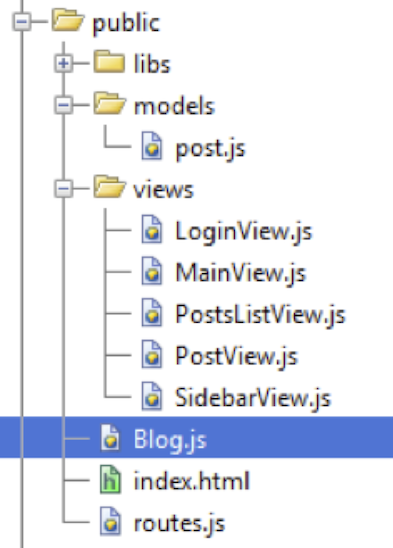

#Organiser son code

>*Sommaire*

>>- *Namespaces & Modules, à l'ancienne*
>>- *"Loader" javascript, comme les vrais*


>*Notre application (côté client) tient dans une seule page. Elle mélange en un seul fichier du code HTML et du code Javascript, et cela commence à devenir difficilement lisible, difficilement modifiable et donc difficilement maintenable. J’aimerais ajouter la possibilité d’ajouter ou de modifier des posts, mais… Faisons d’abord le ménage et rangeons notre code.*

Il y a de nombreuses querelles de chapelles autour du sujet de l’organisation du code (des façons de le faire), et je vous avoue que je n’ai pas encore fait complètement mon choix, mais l’essentiel est de produire quelque chose qui fonctionne (correctement) et que vous pourrez facilement faire évoluer. Je vais donc vous présenter 2 méthodes, la méthode « à l’ancienne » qui a le mérite de fonctionner, d’être rapide, et la méthode « hype » pour les champions qui est intéressante à connaître tout particulièrement dans le cadre de gros projets.

>>**Remarque** : pour la méthode "hype", j'utilise le(s) outil(s) (yepnope) que je préfère, il est tout à fait possible de suivre le principe décrit avec d'autres comme require.js et d'autres... Je n'ai pas la science infuse, je me sens plus à l'aise avec YepNope... c'est tout, et tant que ça marche ;) ...

##"À l'ancienne"

###Namespace

Créer une application Backbone, c’est écrire des modèles, des vues, des templates, etc. Et une des bonnes pratiques pour parvenir à garder ceci bien organisé est d’utiliser le **namespacing** (comme en .Net, Java…) de la façon suivante :

*Namespace Blog :*

```javascript
var Blog = {
	Models: {},
	Collections: {},
	Views: {},
	Router: {}
}
```

Vous enregistrez ceci dans un fichier `Blog.js`, que vous pensez à référencer dans votre page html :

```html
<script src="Blog.js"></script>
```

Ainsi par la suite vous pourrez déclarer et faire référence à vos composants de la manière suivante :

```javascript
Blog.Models.Post = Backbone.Model.extend({
	//...
});

Blog.Collections.Posts = Backbone.Collection.extend({
	//...
});
Blog.Views.PostForm = Backbone.View.extend({
	//...
});

//etc…
```


Puis les utiliser comme ceci :

```javascript
var myPost = new Blog.Models.Post();
var posts = new Blog.Collections.Posts();
var postForm = new Blog.Views.PostForm();
```

Du coup, à la lecture du code, on voit tout de suite que `myPost` est un modèle, `posts` une collection et `postForm` une vue.

Cela va donc permettre de créer d’autres fichiers javascript spécifiques à chacun de vos composants, par exemple un fichier `post.js` avec le code de votre modèle `post` *(en général j’y ajoute aussi la collection correspondante)*, puis autant de fichiers javascript que de vues. Cela va augmenter le nombre de vos fichiers, mais à chaque modification vous n’aurez à vous concentrer que sur une seule portion de code.

Puis vous pouvez aussi organiser vos fichiers javascript dans des répertoires. Voici comment je procède :

\

Je crée un répertoire `libs/vendors` pour tous les scripts « qui ne sont pas de moi » (jQuery, Backbone, etc.), puis je range mes modèles dans un répertoire `models`, mes vues dans un répertoire `views`. Au même endroit que ma page `index.html`, je positionne le fichier `routes.js `(mon routeur) ainsi que le fichier `Blog.js` qui contient mes **« namespaces »**, et enfin je déclare tout ceci dans ma page `index.html `:


```html
<!-- === Références aux Frameworks === -->
<script src="libs/vendors/jquery.js"></script><!--V 1.10.2 -->
<script src="libs/vendors/underscore.js"></script><!--V 1.5.2 -->
<script src="libs/vendors/backbone.js"></script><!--V 1.1.0 -->
<script src="libs/vendors/mustache.js"></script>

<!-- === code applicatif === -->

<script src="Blog.js"></script>
<script src="models/Post.js"></script> <!-- Models & Collection -->

<!-- Backbone Views -->
<script src="views/SidebarView.js"></script>
<script src="views/PostsListView.js"></script>
<script src="views/MainView.js"></script>
<script src="views/LoginView.js"></script>
<script src="views/PostView.js"></script>

<script src="routes.js"></script>
```

Pour ensuite écrire mon code javascript de « lancement », clairement simplifié par rapport à ce que nous avons fait jusqu’ici :

```html
<script>
	$(function (){

	window.blogPosts = new Blog.Collections.Posts();

	window.mainView = new Blog.Views.MainView({
		collection: blogPosts
	});

	/*======= Authentification =======*/
	window.loginView = new Blog.Views.LoginView();
	/*======= Fin authentification =======*/

	window.postView = new Blog.Views.PostView();


	window.router = new Blog.Router.RoutesManager({
		collection: blogPosts
	});
	Backbone.history.start();
	});
</script>
```

>>**Remarque** : Vous n’êtes pas obligés de faire comme moi, adaptez selon vos goûts ou les normes imposées sur les projets. Et n’hésitez pas à me contacter pour me donner des astuces pour améliorer mon organisation de code.


###Modules

J’aime bien combiner la notion de module à la notion de namespace, ce qui permet d’associer à notre namespace une notion de variable ou de fonctions privées, mais aussi de créer un système de plugin. Je vous montre avec le code, ce sera plus « parlant » :

Avant nous avions donc ceci :

*Namespace Blog :*

```javascript
var Blog = {
  Models: {},
  Collections: {},
  Views: {},
  Router: {}
}
```

Que nous allons changer par ceci :

*Module+Namespace :*

```javascript
var Blog = (function() {
  var blog = {};

  blog.Models = {};
  blog.Collections = {};
  blog.Views = {};
  blog.Router = {};

  return blog;
  }());
```

Cela signifie que seul la variable `blog` sera exposée par l’entremise de la variable `Blog`. Tout ce qui est entre `(function () {` et `}());` sera exécuté. A l’intérieur de cette closure vous pouvez coder des variables et des méthodes privées.

Ensuite vous allez pouvoir déclarer des « plug-ins » à votre module de la manière suivante (par exemple):

```javascript
var Blog = (function(blog) {

  blog.Models.Post = Backbone.Model.extend({
    urlRoot: "/blogposts"

  });

  blog.Collections.Posts = Backbone.Collection.extend({
    model: blog.Models.Post,
    all: function() {
      this.url = "/blogposts";
      return this;
    },
    query: function(query) {
      this.url = "/blogposts/query/" + query;
      return this;
    }

  });

  return blog;
}(Blog));
```

###Au final, nous aurons...

Avec les principes décrits plus haut, nous allons donc pouvoir "découper" notre code afin de bien tout ordonner, et nous obtiendrons les fichiers suivants :

*Blog.js :*

```javascript
var Blog = (function() {
  var blog = {};

  blog.Models = {};
  blog.Collections = {};
  blog.Views = {};
  blog.Router = {};

  return blog;
}());
```

*routes.js :*

```javascript
var Blog = (function(blog) {

  blog.Router.RoutesManager = Backbone.Router.extend({
    initialize: function(args) {
      this.collection = args.collection;
    },
    routes: {
      "post/:id_post": "displayPost",
      "hello": "hello",
      "*path": "root"
    },
    root: function() {
      this.collection.all().fetch({
        success: function(result) {
          //ça marche !!!
        }
      });
    },

    hello: function() {
      $(".jumbotron > h1").html("Hello World !!!");
    },

    displayPost: function(id_post) {

      var tmp = new blog.Models.Post({
        id: id_post
      });

      tmp.fetch({
        success: function(result) {
          postView.render(result);
        }
      });
    }
  });

  return blog;
}(Blog));
```

*models/post.js :*

```javascript
var Blog = (function(blog) {

  blog.Models.Post = Backbone.Model.extend({
    urlRoot: "/blogposts"
  });

  blog.Collections.Posts = Backbone.Collection.extend({
    model: blog.Models.Post,
    all: function() {
      this.url = "/blogposts";
      return this;
    },
    query: function(query) {
      this.url = "/blogposts/query/" + query;
      return this;
    }
  });

  return blog;
}(Blog));
```

*views/SidebarView.js :*

```javascript
var Blog = (function(blog) {

  blog.Views.SidebarView = Backbone.View.extend({
    el: $("#blog_sidebar"),
    initialize: function() {
      this.template = $("#blog_sidebar_template").html();
    },
    render: function() {
      var renderedContent = Mustache.to_html(this.template, {
        posts: this.collection.toJSON()
      });

      this.$el.html(renderedContent);
    }
  });

  return blog;
}(Blog));
```

*views/PostsListViews.js :*

```javascript
var Blog = (function(blog) {

blog.Views.PostsListView = Backbone.View.extend({
  el: $("#posts_list"),
  initialize: function() {
    this.template = $("#posts_list_template").html();
  },
  render: function() {
    var renderedContent = Mustache.to_html(this.template, {
      posts: this.collection.toJSON()
    });

    this.$el.html(renderedContent);
  }
});

return blog;
}(Blog));
```

*views/MainView.js :*

```javascript
var Blog = (function(blog) {

  blog.Views.MainView = Backbone.View.extend({
    initialize: function() {

      this.collection.comparator = function(model) {
        return -(new Date(model.get("date")).getTime());
      }

      _.bindAll(this, 'render');
      this.collection.bind('reset', this.render);
      this.collection.bind('change', this.render);
      this.collection.bind('add', this.render);
      this.collection.bind('remove', this.render);

      this.sidebarView = new blog.Views.SidebarView();
      this.postsListView = new blog.Views.PostsListView({
        collection: this.collection
      });

    },
    render: function() {

      //this.collection.models = this.collection.models.reverse();
      this.sidebarView.collection = new blog.Collections.Posts(this.collection.first(3));
      this.sidebarView.render();
      this.postsListView.render();
    }
  });

  return blog;
}(Blog));
```

*views/LoginView.js :*

```javascript
var Blog = (function(blog) {

  blog.Views.LoginView = Backbone.View.extend({
    el: $("#blog_login_form"),

    initialize: function() {
      var that = this;
      this.template = $("#blog_login_form_template").html();

      //on vérifie si pas déjà authentifié
      $.ajax({
        type: "GET",
        url: "/alreadyauthenticated",
        error: function(err) {
          console.log(err);
        },
        success: function(dataFromServer) {

          if (dataFromServer.firstName) {
            that.render("Bienvenue", dataFromServer);
          } else {
            that.render("???", {
              firstName: "John",
              lastName: "Doe"
            });
          }
        }
      })

    },

    render: function(message, user) {

      var renderedContent = Mustache.to_html(this.template, {
        message: message,
        firstName: user ? user.firstName : "",
        lastName: user ? user.lastName : ""
      });
      this.$el.html(renderedContent);
    },
    events: {
      "click  .btn-primary": "onClickBtnLogin",
      "click  .btn-default": "onClickBtnLogoff"
    },
    onClickBtnLogin: function(domEvent) {

      var fields = $("#blog_login_form :input"),
        that = this;

      $.ajax({
        type: "POST",
        url: "/authenticate",
        data: {
          email: fields[0].value,
          password: fields[1].value
        },
        dataType: 'json',
        error: function(err) {
          console.log(err);
        },
        success: function(dataFromServer) {

          if (dataFromServer.infos) {
            that.render(dataFromServer.infos);
          } else {
            if (dataFromServer.error) {
              that.render(dataFromServer.error);
            } else {
              that.render("Bienvenue", dataFromServer);
            }
          }

        }
      });
    },
    onClickBtnLogoff: function() {

      var that = this;
      $.ajax({
        type: "GET",
        url: "/logoff",
        error: function(err) {
          console.log(err);
        },
        success: function(dataFromServer) {
          console.log(dataFromServer);
          that.render("???", {
            firstName: "John",
            lastName: "Doe"
          });
        }
      })
    }

  });

  return blog;
}(Blog));
```

*views/PostView.js :*

```javascript
var Blog = (function(blog) {

  blog.Views.PostView = Backbone.View.extend({
    el: $("#posts_list"),
    initialize: function() {
      this.template = $("#post_details_template").html();
    },
    render: function(post) {
      var renderedContent = Mustache.to_html(this.template, {
        post: post.toJSON()
      });

      this.$el.html(renderedContent);
    }
  });

  return blog;
  }(Blog));
```

... Sauvegardez tout ça et essayez, normalement cela devrait fonctionner et vous verrez qu'à l'usage, le code en devient plus lisible. Mais passons donc à la 2ème méthode.

##Méthode “hype”, comme les vrais

Plus les fichiers javascript se multiplient, plus la gestion des `<script src=”…”>` devient pénible, sans compter que dans certains cas il est nécessaire de gérer l’ordre d’inclusion, que l’on aimerait pouvoir déclencher un traitement uniquement lorsque l’on est sûr que notre script est chargé, etc.

Pour répondre à ces types de problématiques, il existe ce que l’on appelle des “loaders” (chargeurs) de scripts, tels :

- Require.js (probalement le plus connu et le plus utilisé) [http://requirejs.org/](http://requirejs.org/)
- Head.js [http://headjs.com/](http://headjs.com/)
- YepNope [http://yepnopejs.com/](http://yepnopejs.com/) d'Alex Sexton
- Etc.

Il y a beaucoup de débats autour des « javascript resources loaders », « est-ce bien ou mal ? », « cela ralentit le chargement de la page web », « c’est génial il faut généraliser son utilisation »… Mon propos n’est pas de participer au débat mais de vous montrer « rapidement » de quelle façon on peut les utiliser. (Cependant si votre application est simple, cela ne vaut pas la peine d’en utiliser, si ce n’est à titre éducatif ou pour le plaisir).

>>**Remarque** : si vous souhaitez creuser le sujet je vous engage à lire « Non-onload-blocking async JS » de  Stoyan Stefanov : [http://www.phpied.com/non-onload-blocking-async-js/](http://www.phpied.com/non-onload-blocking-async-js/).

En ce qui nous concerne, j’ai choisi **YepNope** parce que nettement plus simple (plus léger aussi) que Require.js et développé par Alex Sexton, ce qui est un gage de qualité (excellent développeur javascript et qui prend le temps de répondre à vos questions, ce qui n’est pas négligeable).

###Préparation

Commencez par télécharger la dernière version de YepNope ici :

- [https://github.com/SlexAxton/yepnope.js/archives/master](https://github.com/SlexAxton/yepnope.js/archives/master)

Puis, dézipper et copier ensuite le fichier `yepnope.js` ou sa version minifiée (dans mon cas j’ai utilisé la version 1.5.4) dans le répertoire `public/libs/vendors` de votre application.

Nous allons maitenant supprimer toutes les références de script que nous avions dans la page index.html :

```html
<!-- === Frameworks === -->
<script src="libs/vendors/jquery-1.7.2.js"></script>
<script src="libs/vendors/underscore.js"></script>
<script src="libs/vendors/backbone.js"></script>
<script src="libs/vendors/mustache.js"></script>

<!-- === code applicatif === -->

<script src="Blog.js"></script>
<script src="models/Post.js"></script> <!-- Models & Collection -->

<!-- Backbone Views -->
<script src="views/SidebarView.js"></script>
<script src="views/PostsListView.js"></script>
<script src="views/MainView.js"></script>
<script src="views/LoginView.js"></script>
<script src="views/PostView.js"></script>

<script src="routes.js"></script>
```

Et nous écrivons ceci à la place :

```html
<script src="libs/vendors/yepnope.1.5.4-min.js"></script>
<script src="main.js"></script>
```

Et c’est donc dans le script `main.js` que nous allons procéder au chargement de nos différents scripts de la manière suivante :

*1ère utilisation de yepnope :*

```javascript
yepnope({
  load: {
    jquery: 'libs/vendors/jquery-1.7.2.js',
    underscore: 'libs/vendors/underscore.js',
    backbone: 'libs/vendors/backbone.js',
    mustache: 'libs/vendors/mustache.js',

    //NameSpace
    blog: 'Blog.js',

    //Models
    posts: 'models/post.js',

    //Controllers
    sidebarview: 'views/SidebarView.js',
    postslistviews: 'views/PostsListView.js',
    mainview: 'views/MainView.js',
    loginview: 'views/LoginView.js',
    postview: 'views/PostView.js',

    //Routes
    routes: 'routes.js'

  },

  callback: {
    "routes": function() {
      console.log("routes loaded ...");
    }
  },
  complete: function() {
    //...
  }
});
```

Vous l’aurez compris, le paramètre `load` sert à définir les scripts à charger. Vous notez aussi que l’on peut donner un alias à chacun des scripts (sinon YepNope le fera automatiquement à partir du nom du fichier javascript), alias que l’on peut ensuite utiliser dans le paramètre `callback` pour déclencher un traitement une fois que le script est inclus dans la page (dans notre exemple c’est au moment de l’inclusion du fichier `routes.js`).

Et enfin, il y a aussi le paramètre `complete` qui permet de lancer un traitement une fois tous les scripts inclus.

Nous allons donc déplacer le javascript restant dans notre page à l’intérieur de complete, pour finalement obtenir ceci :

*Code définitif :*

```javascript
yepnope({
  load: {
    jquery: 'libs/vendors/jquery-1.7.2.js',
    underscore: 'libs/vendors/underscore.js',
    backbone: 'libs/vendors/backbone.js',
    mustache: 'libs/vendors/mustache.js',

    //NameSpace
    blog: 'Blog.js',

    //Models
    posts: 'models/post.js',

    //Controllers
    sidebarview: 'views/SidebarView.js',
    postslistviews: 'views/PostsListView.js',
    mainview: 'views/MainView.js',
    loginview: 'views/LoginView.js',
    postview: 'views/PostView.js',

    //Routes
    routes: 'routes.js'

  },

  callback: {
    "routes": function() {
      console.log("routes loaded ...");
    }
  },
  complete: function() {
    $(function() {

      console.log("Lauching application ...");

      window.blogPosts = new Blog.Collections.Posts();

      window.mainView = new Blog.Views.MainView({
        collection: blogPosts
      });

      /*======= Authentification =======*/
      window.loginView = new Blog.Views.LoginView();
      /*======= Fin authentification =======*/

      window.postView = new Blog.Views.PostView();

      window.router = new Blog.Router.RoutesManager({
        collection: blogPosts
      });

      Backbone.history.start();

    });
  }
});
```

Et voilà ! Vous disposez maintenant d’un code structuré, d’un outil de chargement de script facile à utiliser et modifier : désactivation ou changement provisoire de librairie pour tests par exemple mais aussi chargement conditionnel de script en fonction du contexte… Je ne vous ai dévoilé qu’une infime partie de YepNope qui, en dépit de sa taille, est très puissant. Lisez la documentation, vous verrez…

Maintenant que notre projet est "propre", nous allons dans le chapitre suivant en profiter pour sécuriser un peu plus notre application.


