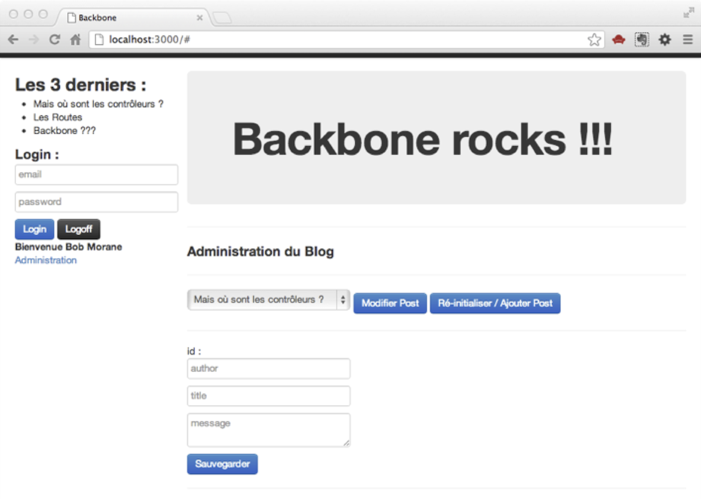
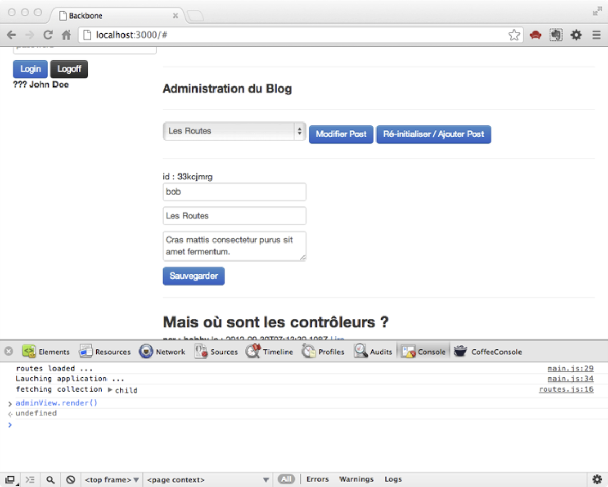
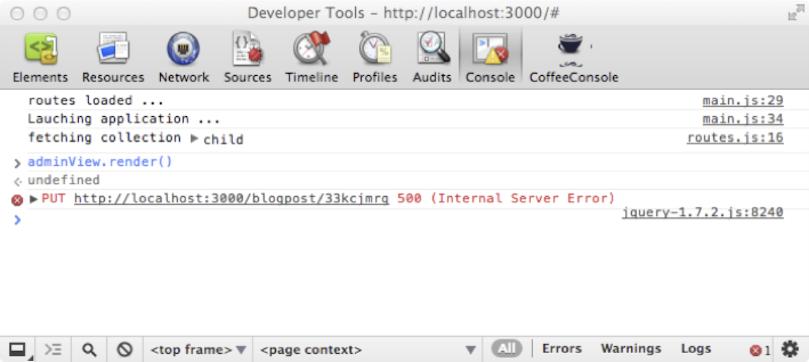
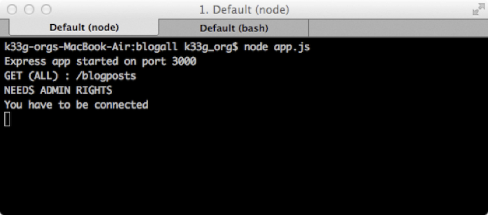
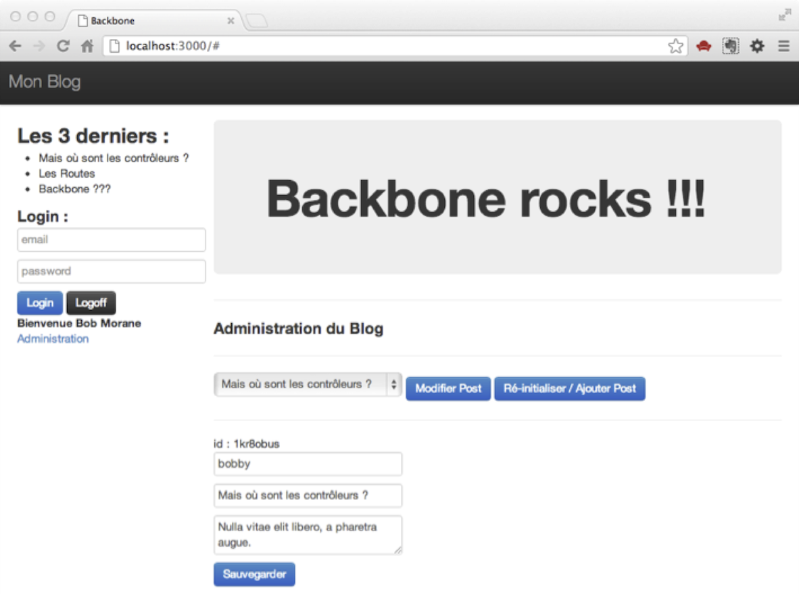
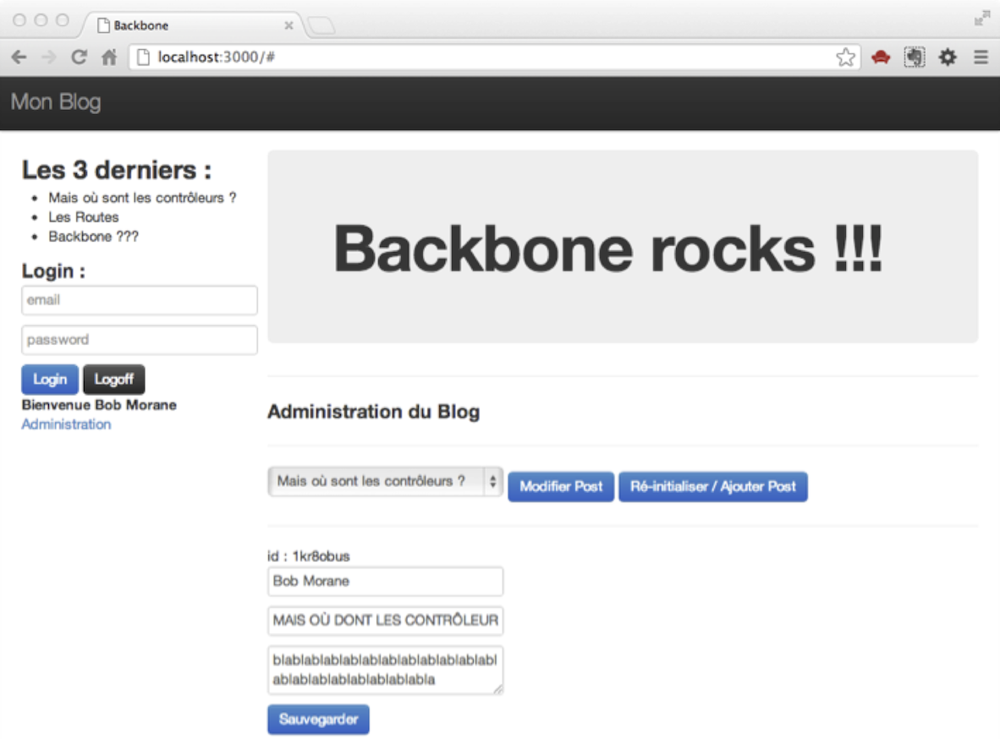
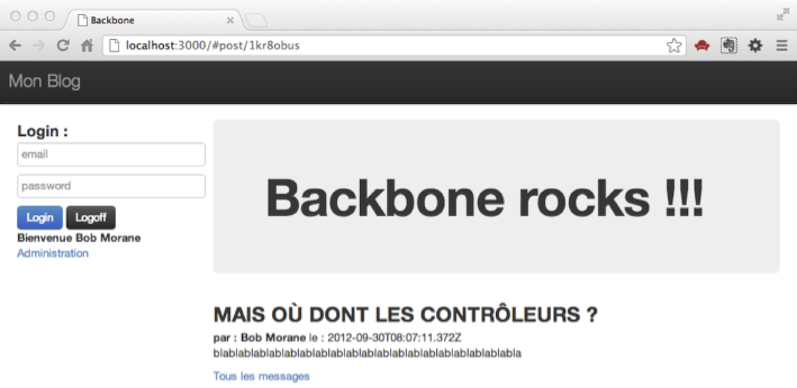

#Securisation

>*Sommaire*

>>- *Un (tout) petit écran d'administration*
>>- *Une "vraie" sécurisation des routes côté serveur*


>*Profitons-en pour terminer (presque) notre application et la sécuriser. Je dis “presque”, car il y aura toujours des fonctionnalités à ajouter, des contrôles de saisie à faire, des codes à optimiser (vous verrez dans ce qui va suivre que ma façon d’accéder au DOM n’est pas forcément la plus élégante à défaut d’être la plus lisible), la gestion des commentaires, refaire l’authentification...*

Je souhaite cependant pouvoir modifier et ajouter des messages (post). C’est un exercice pour démontrer l’utilité de l’organisation du code en modules pour mieux s’y retrouver.


##Il nous faut un "écran d’administration"

Je retourne donc dans le code html de ma page `index.html`. Ajoutons ceci juste après le “grand titre” de notre blog :

*Template de l’écran d’administration :*

```html
<div class="col-md-9">
  <div class="jumbotron">
      <h1>Backbone rocks !!!</h1>
  </div>

  <!--- Admin --->
  <script type="text/template" id="admin_template">
    <hr>
    <h3>Administration du Blog</h3>
    <hr>
    <select id="post_choice">{{#posts}}
        <option value="{{id}}">{{title}}</option>
    {{/posts}}</select>
    <a href="#" id="btn_update" class="btn btn-primary">Modifier Post</a>
    <a href="#" id="btn_create" class="btn btn-primary">Ré-initialiser / Ajouter Post</a>
    <hr>
      id : <span name="id"></span><br>
      <input name="author" type="text" placeholder="author"/><br>
      <input name="title" type="text" placeholder="title"/><br>
      <textarea name="message" placeholder="message"></textarea><br>
      <a href="#" id="btn_send" class="btn btn-primary">Sauvegarder</a>
    <hr>
  </script>

  <div id="admin"></div>
  <!--- End of Admin --->
</div>
```


J’aurais donc un écran qui va ressembler à ceci :

\


Pour gérer cet écran je vais avoir besoin d’un objet de type `Backbone.View`, que nous allons créer dans le répertoire `/views` sous le nom d’`AdminView.js`.
Avant de “coder” `AdminView`, nous allons le déclarer et l’instancier dans `main.js` :

*main.js : :*

```javascript
yepnope({
  load: {
    jquery: 'libs/vendors/jquery-1.7.2.js',
    underscore: 'libs/vendors/underscore.js',
    backbone: 'libs/vendors/backbone.js',
    mustache: 'libs/vendors/mustache.js',

    //NameSpace
    blog: 'Blog.js',

    //Models
    posts: 'models/post.js',

    //Controllers
    sidebarview: 'views/SidebarView.js',
    postslistviews: 'views/PostsListView.js',
    mainview: 'views/MainView.js',
    loginview: 'views/LoginView.js',
    postview: 'views/PostView.js',

    //--- ADMINVIEW---
    adminview: 'views/AdminView.js',

    //Routes
    routes: 'routes.js'
  },

  callback: {
    "routes": function() {
      console.log("routes loaded ...");
    }
  },
  complete: function() {
    $(function() {
      console.log("Lauching application ...");

      window.blogPosts = new Blog.Collections.Posts();

      window.mainView = new Blog.Views.MainView({
        collection: blogPosts
      });

      /*======= Admin =======*/
      window.adminView = new Blog.Views.AdminView({
        collection: blogPosts
      });
      /*======= Fin Admin =======*/

      /*======= Authentification =======*/
      window.loginView = new Blog.Views.LoginView({
        adminView: adminView
      });
      /*======= Fin authentification =======*/

      window.postView = new Blog.Views.PostView();

      window.router = new Blog.Router.RoutesManager({
        collection: blogPosts
      });
      //Backbone.history.start({pushState: true});
      Backbone.history.start();

    });
  }
});

```

>>**Remarque** : Je passe la vue adminView à la vue loginView pour que cette dernière puisse déclencher le rendue de la première si nécessaire.


###Création d'AdminView

Alors il n'y a pas grand chose à expliquer (c'est dans le code)

*AdminView.js :*

```javascript
var Blog = (function(blog) {

  blog.Views.AdminView = Backbone.View.extend({
    el: $("#admin"),
    initialize: function() {
      this.template = $("#admin_template").html();
      //je prévois de trier ma collection
      this.collection.comparator = function(model) {
        return -(new Date(model.get("date")).getTime());
      }
    },
    render: function() {
      var renderedContent = Mustache.to_html(this.template, {
        posts: this.collection.toJSON()
      });
      this.$el.html(renderedContent);
    },
    events: {
      "click  #btn_update": "onClickBtnUpdate",
      "click  #btn_create": "onClickBtnCreate",
      "click  #btn_send": "sendPost"
    },

    onClickBtnUpdate: function() {
      var selectedId = $("#post_choice").val(),
        post = this.collection.get(selectedId);

      //Je récupère les informations du post et les affiche
      $("#admin > [name='id']").html(post.get("id"));
      $("#admin > [name='author']").val(post.get("author"));
      $("#admin > [name='title']").val(post.get("title"));
      $("#admin > [name='message']").val(post.get("message"));

    },
    onClickBtnCreate: function() {
      //je ré-initialise les zones de saisie
      $("#admin > [name='id']").html("");
      $("#admin > [name='author']").val("");
      $("#admin > [name='title']").val("");
      $("#admin > [name='message']").val("");
    },
    sendPost: function() { //Sauvegarde
      var that = this //pour conserver le contexte
      ,
        id = $("#admin > [name='id']").html(),
        post;

      if (id === "") { //si l'id est vide c'est une création
        post = new Blog.Models.Post();
      } else { //l'id n'est pas vide c'est une mise à jour
        post = new Blog.Models.Post({
          id: $("#admin > [name='id']").html()
        });
      }

      post.save({
        author: $("#admin > [name='author']").val(),
        title: $("#admin > [name='title']").val(),
        message: $("#admin > [name='message']").val(),
        date: new Date()
      }, {
        success: function() {
          //Si la transaction côté serveur a fonctionné

          //je recharge ma collection
          that.collection.fetch({
            success: function() {
              //mise à jour de la vue admin
              that.render();
              //La vue principale se re-mettra à jour
              //automatiquement, car elle est "abonnée"
              //aux changement de la collection
            }
          });
        },
        error: function() {}
      });
    }
  });
  return blog;
}(Blog));

```

>>**Remarque** : je n’abonne pas la vue aux changement de la collection pour pouvoir maîtriser le moment où je déclenche la méthode render() de celle-ci.

###Modification de LoginView

Nous allons modifier `LoginView.js` pour prendre en compte l’ajout de notre fonctionnalité d’administration. Tout d’abord modifions le template associé :

*Template du formulaire de login :*

```html
<!-- /*======= Formulaire d'authentification =======*/ -->
<script type="text/template" id="blog_login_form_template">
  <h3>Login :</h3>
  <input name="email" type="text" placeholder="email"/><br>
  <input name="password" type="password" placeholder="password"/><br>
  <a href="#" class="btn btn-primary">Login</a>
  <a href="#" class="btn btn-default">Logoff</a><br>
  <b>{{message}} {{firstName}} {{lastName}} </b>
  <br><a id="adminbtn" href="#">{{adminLinkLabel}}</a>
</script>
<form class="container" id="blog_login_form">

</form>
<!-- /*======= Fin du formulaire=======*/ -->
```

Puis modifions le code de LoginView.js :

*LoginView.js :*

```javascript
var Blog = (function(blog) {

  blog.Views.LoginView = Backbone.View.extend({
    el: $("#blog_login_form"),

    initialize: function(args) {
      var that = this;

      this.adminView = args.adminView;

      this.template = $("#blog_login_form_template").html();

      //on vérifie si pas déjà authentifié
      $.ajax({
        type: "GET",
        url: "/alreadyauthenticated",
        error: function(err) {
          console.log(err);
        },
        success: function(dataFromServer) {

          if (dataFromServer.firstName) {

            that.render("Bienvenue", dataFromServer);

          } else {
            that.render("???", {
              firstName: "John",
              lastName: "Doe"
            });
          }
        }
      })
    },
    render: function(message, user) {

      var renderedContent = Mustache.to_html(this.template, {
        message: message,
        firstName: user ? user.firstName : "",
        lastName: user ? user.lastName : "",
        adminLinkLabel: user ? user.isAdmin ? "Administration" : "" : ""
      });
      this.$el.html(renderedContent);
    },
    events: {
      "click  .btn-primary": "onClickBtnLogin",
      "click  .btn-default": "onClickBtnLogoff",
      "click #adminbtn": "displayAdminPanel"
    },

    displayAdminPanel: function() {
      //this.adminView.render();
    },

    onClickBtnLogin: function(domEvent) {
      //code non affiché pour des raisons de mise en page
      //ne pas modifier
    },
    onClickBtnLogoff: function() {
      //code non affiché pour des raisons de mise en page
      //ne pas modifier
    }

  });
  return blog;
}(Blog));
```

Maintenant que nous avons fait nos modifications côté client, allons sécuriser les actions côté serveur.

##Sécurisation côté serveur

Vous pouvez tester les modifications dès maintenant, cela va fonctionner, mais il est de bon ton de sécuriser côté serveur les actions de création, modification, suppression, etc. …

>>**Remarque** : La gestion des session avec express.js ainsi que la sécurisation des routes peut être prise en compte de manière plus « professionnel ». Gardez à l’esprit que les exemples donnés le sont à titre « didactique » et que certains points sont perfectibles.

Nous allons retourner dans le code de `app.js` (vous vous souvenez : notre application express.js) et créer une fonction qui permet de vérifier si l’utilisateur est connecté et est administrateur et cette fonction servira à sécuriser les routes :

###Sécurisation des routes

Notre fonction vérifie si l'utilisateur connecté est un administrateur, si c'est le cas, elle passe la main à la fonction "callback" que j'ai appelée `next` sinon elle génère une erreur.

*Fonction haveToBeAdmin :*

```javascript
haveToBeAdmin = function(req, res, next) {
  console.log("NEEDS ADMIN RIGHTS");
  if (findUserBySession(req.sessionID)) {
    if (findUserBySession(req.sessionID).isAdmin == true) {
      next();
    } else {
      throw "You have to be administrator";
    }
  } else {
    throw "You have to be connected";
  }
}
```

>>**Remarque** : Si la condition est vérifiée, la fonction `next()` est appelée, elle correspond au traitement de la route sécurisée.

Et sécurisons ensuite nos routes de la manière suivante :

*Ajout :*

```javascript
app.post('/blogposts', [haveToBeAdmin], function(req, res, next) {
  console.log("POST CREATE ", req.body);

  var d = new Date(),
    model = req.body;
  model.saveDate = (d.valueOf());

  posts.save(null, model, function(err, key) {
    if (err) {
      console.log("Erreur : ", err);
      res.json(err);
    } else {
      model.id = key;
      res.json(model);
    }
  });
});
```

>>**Remarque "au passage"** : vous remarquez le passage du paramètre `[haveToBeAdmin]`, le contenu de `app.post` ne sera exécuté que si `haveToBeAdmin` "déclenche" `next`.

De la même façon pour la mise à jour et la suppression :

*Mise à jour :*

```javascript
app.put('/blogposts/:id', [haveToBeAdmin], function(req, res, next) {
  console.log("PUT UPDATE", req.body, req.params.id);

  var d = new Date(),
    model = req.body;
  model.saveDate = (d.valueOf());

  posts.save(req.params.id, model, function(err, key) {
    if (err) {
      console.log("Erreur : ", err);
      res.json(err);
    } else {
      res.json(model);
    }
  });
});
```

*Suppression :*

```javascript
app.delete('/blogposts/:id', [haveToBeAdmin], function(req, res, next) {
  console.log("DELETE : /delete/" + req.params.id);

  posts.remove(req.params.id, function(err) {
    if (err) {
      console.log("Erreur : ", err);
      res.json(err);
    } else {
      //petit correctif de contournement (bug ds nStore) :
      //ré-ouvrir la base lorsque la suppression a été faite
      posts = nStore.new("blog.db", function() {
        res.json(req.params.id);
        //Le modèle est vide si on ne trouve rien
      });
    }
  });
});
```

###Eh bien testons, maintenant

- Relancez l’application côté serveur.
- Ouvrez le navigateur et connectez vous au blog sans vous authentifier.
- Ouvrez la console du navigateur et saisissez ceci : `adminView.render()`.

Cela va faire apparaître l’écran d’administration alors que vous n’êtes pas administrateur (vous faites une tentativve de hacking sur vous même) !

Sélectionnez un Post dans la liste, et cliquez sur “modifer Post” pour charger le formulaire :

\


Saissez quelques modifications, cliquez sur le bouton “Sauvegarder” . Vous obtiendrez un message d’erreur dans la console :

\


A vous de gérer les message côté client (avec le callback “error” lors du `save()`)
Et côté serveur cela vous affiche que vous devez être connecté :

\


Donc notre blog est bien "sécurisé". Maintenant rafraichissez votre page et connectez vous en tant qu’administrateur. Vous obtiendrez un lien “Administration” au niveau du message de bienvenue qui vous permettra de déclencher l’affichage de l’écran d’administration :

\


Faites quelques modifications, et sauvegardez les modifications :

\


Vous pouvez ensuite vérifiez qu’elles ont bien été prises en compte :

\


Voilà. Notre application est "terminée". Je sais il faut le dire vite ;) mais vous avez une base, que vous pouvez faire évoluer (il faudrait ajouter les commentaires par exemple) ou améliorer, ou mieux, cassez tout et faites votre propre application avec votre "propre style".

Par contre, l'ouvrage n'est pas fini, j'ai encore 2,3 petites choses dont j'aimerais vous parlez.


