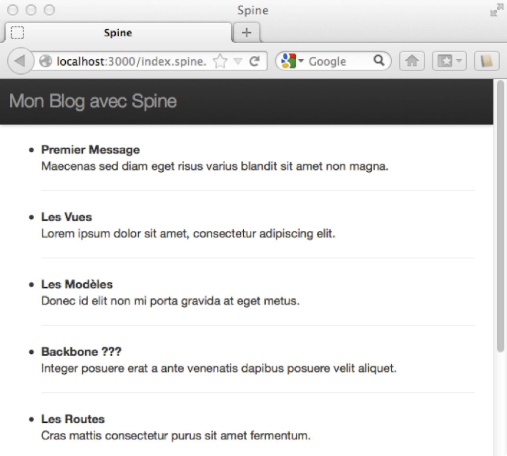
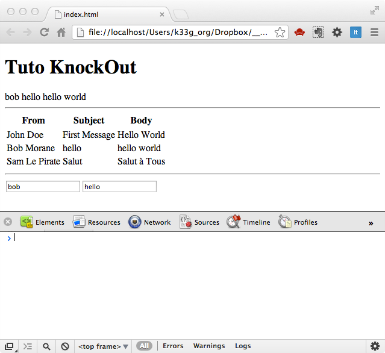
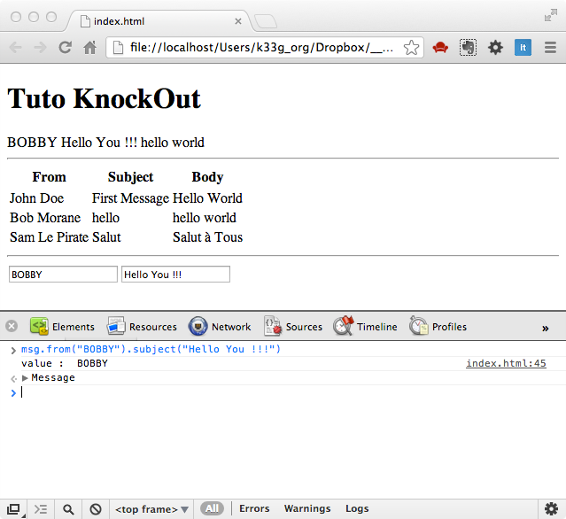
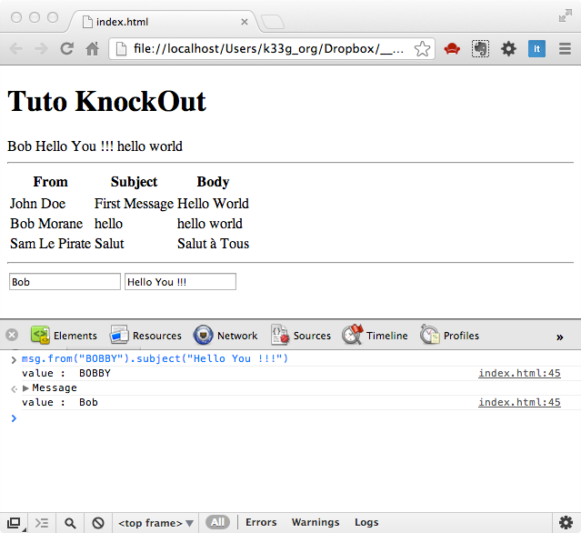
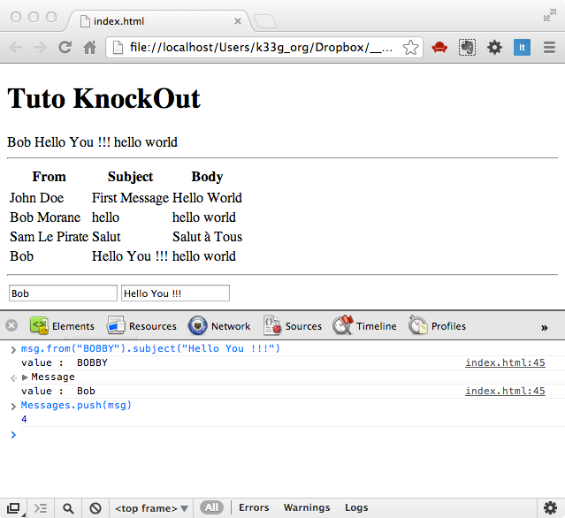
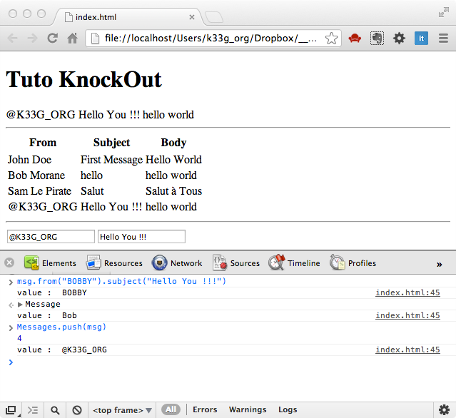

#Autres Frameworks MVC

>*Sommaire*

>>- *CanJS*
>>- *Spine*
>>- *Knockout*
>>- *Les autres ...*


>*Il faut aller voir ailleurs !!! Backbone peut ne pas correspondre à vos attentes, à votre façon de coder… Je vous engage à tester d'autres frameworks.*

>*Il existe aujourd’hui de TRES nombreux frameworks MVC en javascript “côté navigateur”. Certains fournissent beaucoup plus de services que Backbone, d’autres vont même plus loin, puisqu’ils vont jusqu’à fournir un framework associé côté serveur (en javascript avec du nodejs). Ils sont plus ou moins complexes, plus ou moins bien documentés.*

L'objectif de ce chapitre n'est pas de faire un cours sur tous les frameworks javascript existants (chacun mériterait un ouvrage), mais de lever un coin de voile sur eux, et montrer que chacun possède ses spécificités. J'en ai sélectionné 2, sur un seul critère de sélection (qui me tient à coeur) : **LA SIMPLICITE** (après la notion de simplicité d'un dev à l'autre, est relative ...), il faut que le framework soit simple à mettre en oeuvre, sans pour autant être obligé de le connaître par coeur avant de pouvoir l'utiliser. Autrement dit, si au bout d’un quart d’heure de lecture, vous avez compris les principes de bases, le framework que vous étudiez est susceptible d’être facilement compréhensible par le reste de votre équipe (par exemple) et donc vous ne devriez pas avoir de frein à l’adoption. Si au bout d’une demi-heure, vous n’êtes pas arrivé à l’installé correctement, vous pouvez commencer à avoir des doutes (c’est une méthode très personnelle, si elle ne garantit pas les fonctionnalités du framework, elle vous assure au moins sa simplicité). La qualité de la documentation peut avoir un impact fort dans vos choix.

##CanJS

[http://canjs.us](http://canjs.us)

**CanJS** n'est pas le plus léger des frameworks, mais son approche est très intéressante et relativement intuitive, tout particulièrement pour des développeurs "backend". D'un point de vue objet, on retrouve dès le départ le concept de méthode statique dans le modèle, et c'est la "pseudo classe" modèle qui se chargera de "ramener" un modèle, mais aussi la liste des modèles (alors que dans Backbone, c'est un objet à part : la collection qui s’en charge). Mais un exemple sera tout de suite beaucoup plus parlant :

**Définition d’un modèle :**

```javascript
var Post = can.Model({
  findAll : 'GET /blogposts',
  findOne : 'GET /blogposts/{id}',
  create  : 'POST /blogposts',
  update  : 'PUT /blogposts/{id}',
  destroy : 'DELETE /blogposts/{id}'
}, {});
```

Ensuite si je souhaite “récupérer” du serveur un modèle particulier par son id :

```javascript
Blog.Post.findOne({id:"2o03macl"},function(post){console.log(post);})
```

Puis, si je veux tous les modèles :

```javascript
Blog.Post.findAll({}, function(posts){ console.log(posts);});
```

... qui me retournera un tableau de modèles.

Vous remarquerez que l'on définit toutes les routes au niveau du modèle, et non pas une seule url comme dans Backbone.

Question templating, **CanJS** embarque son propre langage de template qui ressemble fortement à celui d'Underscore (mais rien ne vous empêche d'utiliser autre chose). Côté "DOM", **CanJS** sait travailler avec jQuery, Zepto, Dojo, Mootools et YUI, à vous de faire votre choix et de télécharger la version adaptée.


###Mise en oeuvre rapide

Pour notre exemple, j’ai utilisez la version de CanJS adaptée pour jQuery, que vous pouvez télécharger ici : [https://github.com/downloads/jupiterjs/canjs/can.jquery-1.0.7.js](https://github.com/downloads/jupiterjs/canjs/can.jquery-1.0.7.js) et que vous copierez  ensuite dans `public/libs/vendors` (nous utilisons notre application pour pouvoir se connecter à la partie serveur).

Dans notre répertoire public (à la racine), créez une page `index.canjs.html` avec le code suivant :

*Index.canjs.html :*

```html
<!DOCTYPE html>
<html>
<head>
  <meta http-equiv="Content-Type" content="text/html; charset=utf-8">
  <title>CanJS</title>
  <meta name="viewport" content="width=device-width, initial-scale=1.0">
  <!--V 3.0.1 ...-->
  <link href="libs/vendors/bootstrap/css/bootstrap.css" rel="stylesheet">
  <link href="libs/vendors/bootstrap/css/bootstrap-theme.css" rel="stylesheet">
  
  <style>
    body {
      padding-top: 60px;
      padding-bottom: 40px;
    }
  </style>

</head>

<body>

  <div class="navbar navbar-inverse navbar-fixed-top">
    <div class="navbar-header">
        <div class="container">
            <a class="navbar-brand">Mon Blog avec CanJS</a>
        </div>
    </div>
  </div>

  <div class="container">

    <div class="row">

      <script type="text/ejs" id="myposts_template">
        <% for( var i = 0; i < this.length; i++ ) { %>
        <li>
          <b><%= this[i].title %></b>
          <br>
          <p><%= this[i].message %></p>
          <hr>
        </li>
        <% } %>
      </script>

      <ul id="myposts"></ul>

    </div>

  </div>

</body>

<script src="libs/vendors/yepnope.1.5.4-min.js"></script>

<script type="text/javascript">
yepnope({
  load: {
    jquery              : 'libs/vendors/jquery-1.7.2.js',
    canjs               : 'libs/vendors/can.jquery-1.0.7.js'
  },

  complete : function () {
    $(function (){

      window.Blog = {}

      Blog.Post = can.Model({
        findAll : 'GET /blogposts',
        findOne : 'GET /blogposts/{id}',
        create  : 'POST /blogposts',
        update  : 'PUT /blogposts/{id}',
        destroy : 'DELETE /blogposts/{id}'
      }, {});

      Blog.Post.findAll({}, function(posts){
        $('#myposts').html(can.view( 'myposts_template', posts ))
      });
    });
  }
});

</script>
</html>
```

Nous avons conservé le mécanisme de chargement de yepnope et jQuery, donc une fois le chargement de la page terminé, nous avons défini notre modèle avec les routes nécessaires pour accéder aux services de données, puis nous exécutons un `findAll` pour obtenir la liste des posts sur le serveur et l’affichons dans la page une fois les données récupérées grâce à l’objet `can.view`.

Vous n’avez plus qu’à enregistrer et relancer votre application et ouvrir l’url :

`http://localhost:3000/index.canjs.html` dans votre navigateur, pour obtenir la liste des posts :


\


###Conclusion sur CanJS

Je trouve CanJS facile d'accès. Il propose de nombreux plug-ins et apparaît très complet. Pour le moment, le projet semble actif.
D'un point de vue code, il n'a pas la concision de Backbone, il y a beaucoup plus de chose, mais il propose aussi beaucoup plus de services “clés en main”.
Un autre avantage non négligeable est la documentation qui est claire, bien faite et facile d'accès.

>>**Remarque** : Si vous avez un doute sur la pertinence de votre choix, je vous conseille d’aller faire un tour sur [https://github.com/addyosmani/todomvc](https://github.com/addyosmani/todomvc), où Addy Osmani, un googler réputé et spécialiste entre autre de Backbone maintient (avec d’autres développeurs) des exemples de “TODO list” MVC javascript pour chacun des frameworks MVC (ou pas complètement MVC d’ailleurs) du moment. Si le framework que vous étudiez est dans la liste, il y a des chances que ce ne soit pas un mauvais choix, de plus vous disposerez d’un exemple de code (dans les règles de l’art) pour commencer.

##Spine

[http://spinejs.com/](http://spinejs.com/)

**Spine** est très très inspiré de Backbone avec les spécificités suivantes (entre autres) :

- il est écrit en Coffeescript (mais vous pouvez bien sûr l'utiliser en pur javascript)
- Spine propose des Contrôleurs ! ... qui ne sont ni plus ni moins l'équivalent des Backbones.Views
- ... et considère que les vues sont représentée par les templates. A ce sujet Spine propose tout un mécanisme évolué mais nous n'utiliserons que Mustache de la même façon qu'avec Backbone.

Spine peut s'installer avec **npm** (node package manager) et ainsi proposer des outils supplémentaires permettant de générer un squelette de projet, de gérer les dépendances… Mais pour notre exemple, nous allons le faire "à l'ancienne", l'objectif étant de ne modifier en rien la stack serveur existante. Vous pouvez donc vous préparer un environnement identique à celui du chapitre sur Coffeescript ave un répertoire `public.coffee` pour votre code coffeescript et n’oubliez pas le fichier de build `Cakefile`.


Un modèle Spine se décrit de la manière suivante :

```python
class window.Post extends Spine.Model
  @configure "Post", "title", "message", "author"
  @extend Spine.Model.Ajax
  @url: "/blogposts"
```

la ligne `@configure "Post", "title", "message", "author"` définit le nom du modèle et de ses propriétés, ce qui permettra de faire référence ensuite à celles-ci de la façon suivante : `@title, @message, @author`, comme ceci par exemple, si nous ajoutons une méthode `toString()` à notre modèle :

*Utilisation des “propriétés” :*

```python
class Post extends Spine.Model
  @configure "Post", "title", "message", "author"
  @extend Spine.Model.Ajax
  @url: "/blogposts"

  toString:()->
  "#{@title} : #{@message} / #{@author}"
```

Vous remarquerez que l'on ne définit qu'une seule url. Par contre le système de getter et de setter de Backbone disparaît (à vous de les écrire).

En ce qui concerne le contrôleur, il prend la forme suivante :

*Contrôleur spine :*

```python
class Blog extends Spine.Controller

  constructor:()->
  super

  render:()->
```

###Mise en oeuvre rapide

Téléchargez la distribution [http://spinejs.com/pages/download](http://spinejs.com/pages/download), dézippez et copiez les fichiers suivants dans `public/libs/vendors` :

- spine.js
- ajax.js
- list.js
- local.js
- manager.js
- relation.js
- route.js

Cette fois-ci, nous allons utiliser 2 fichiers : une page `index.spine.html` qui affichera nos données et un fichier de script coffeescript `main.spine.coffee` qui contiendra notre code applicatif.

A nouveau, dans notre répertoire `public` (à la racine), créez une page `index.spine.html` avec le code suivant :

*Index.spine.html :*

```html
  <!DOCTYPE html>
  <html>
  <head>
    <meta http-equiv="Content-Type" content="text/html; charset=utf-8">
    <title>Spine</title>
    <meta name="viewport" content="width=device-width, initial-scale=1.0">
    <!--V 3.0.1 ...-->
    <link href="libs/vendors/bootstrap/css/bootstrap.css" rel="stylesheet">
    <link href="libs/vendors/bootstrap/css/bootstrap-theme.css" rel="stylesheet">
    
    <style>
      body {
        padding-top: 60px;
        padding-bottom: 40px;
      }
    </style>

  </head>

  <body>

<div class="navbar navbar-inverse navbar-fixed-top">
        <div class="navbar-header">
            <div class="container">
                <a class="navbar-brand">Mon Blog avec SPINE</a>
            </div>
        </div>
    </div>

    <div class="container">

      <div class="row">

        <script type="text/template" id="myposts_template">
          {{#posts}}
            <li>
              <b>{{title}}</b><br>
              <p>{{message}}</p>
              <hr>
            </li>
          {{/posts}}
        </script>

        <ul id="myposts"></ul>

      </div>

    </div>

  </body>

  <script src="libs/vendors/yepnope.1.5.4-min.js"></script>
  <script src="main.spine.js"></script>

  </html>
```

et enfin dans le répertoire `public.coffee`, créez un fichier `main.spine.coffee` avec le code ci-dessous :

*main.spine.coffee :*

```python
yepnope
  load:
  jquery  : "libs/vendors/jquery-1.7.2.js"
  mustache: "libs/vendors/mustache.js"
  spine   : "libs/vendors/spine.js"
  ajax    : "libs/vendors/ajax.js"
  list    : "libs/vendors/list.js"
  local   : "libs/vendors/local.js"
  manager : "libs/vendors/manager.js"
  relation: "libs/vendors/relation.js"
  route   : "libs/vendors/route.js"

  complete: ->
  $ ->

    class Post extends Spine.Model
    @configure "Post", "title", "message", "author"
    @extend Spine.Model.Ajax
    @url: "/blogposts"

    toString:()->
      "#{@title} : #{@message} / #{@author}"


    class Blog extends Spine.Controller

    constructor:()->
      super
      @posts = []
      @template = $("#myposts_template").html()
      @el = $ "ul"

      # on s'abonne au "rafraîchissement" de la liste des posts
      # lorsque la liste est rafraîchie, on affiche la liste (méthode render)
      Post.bind 'refresh', =>
      @posts = Post.all()
      @render()

      # on charge les posts à partir du serveur
      # cela va déclencher l'évènement "refresh"
      Post.fetch()

    render:()->
      @el.html Mustache.to_html(@template,
      posts: @posts
      )

    window.myBlog = new Blog()
```

Maintenant positionnez vous au même endroit que le fichier `Cakefile`, lancez la commande cake `build`, lancez votre application serveur si ce n'est pas déjà fait et connectez vous, comme pour CanJS, vous obtiendrez à nouveau la même liste des posts dans votre navigateur :

\


###Conclusion sur Spine

Spine est moins simple que Backbone, mais s'en inspire énormément tout en restant facile d'accès (je fais abstraction de Coffeescript en faisant cette remarque). Il est possible d'utiliser Spine directement en javascript, mais le “style” de code ne prend vraiment de l'intérêt que dans un “mode Coffeescript” grace à la notion de classe. De la même façon que CanJS, Spine apporte plus de services “clés en main” que Backbone, comme par exemple la gestion du localstorage. Spine propose aussi un volet “développement mobile” : [http://spinejs.com/mobile/index](http://spinejs.com/mobile/index). Si vous n’êtes pas effrayé par Coffeescript, c’est un framework à suivre et à adopter.

Globalement, ce qui m'a intéressé tant dans CanJS que dans Spine, c'est leur simplicité de mise en oeuvre. Il est possible en quelques minutes d'écrire quelques premières lignes opérationnelles, ce qui n'est pas forcément le cas avec d'autres frameworks beaucoup plus (ou trop?) complets.


##Knockout

Knockout [http://knockoutjs.com](http://knockoutjs.com), l'OVNI de l’équipe, on ne parle plus de MVC mais du pattern “Model-View-View Model”, très très orienté IHM, puisqu'il renforce le lien entre les données et l'IHM, c'est un peu déroutant (mais où est donc encore passé le contrôleur !?), mais cela permet de réaliser des interfaces très réactives en fonction des changements et évolutions des données.

En ce qui concerne **Knockout**, nous n'allons pas repartir de nos exemples précédents, car ce qui caractérise **Knockout**, c'est son système de **"binding"** qui "frise" le **"magique"** : vos actions sur les modèles sont directement impactées sur les vues (le DOM HTML) et inversement vos actions sur le DOM (saisie dans une zone de texte par exemple) sont directement reflétées sur les modèles. Le concept de modèle en tant que tel (comme dans Backbone par exemple) n'existe pas, donc à vous de les écrire, mais **Knockout** apporte les outils nécessaires pour "faire" des **"propriétés observables"** et des **"tableaux observables"** qui seront ensuite "liés" aux vues qui ne sont ni plus ni moins que votre code html.

Donc vous l'aurez compris, **Knockout** met en oeuvre le pattern **Observer** :

[http://en.wikipedia.org/wiki/Observer_pattern](http://en.wikipedia.org/wiki/Observer_pattern)

Ou encore mieux, la version "javascript" par Addy Osmani :

[http://addyosmani.com/resources/essentialjsdesignpatterns/book/#observerpatternjavascript](http://addyosmani.com/resources/essentialjsdesignpatterns/book/#observerpatternjavascript).

###Mise en oeuvre très très rapide ... Mais suffisante

Récupérez donc la librairie Knockout.js par ici :

[http://cloud.github.com/downloads/SteveSanderson/knockout/knockout-2.2.0.js](http://cloud.github.com/downloads/SteveSanderson/knockout/knockout-2.2.0.js)

Puis copiez la dans un répertoire, dans lequel vous allez créer une page `index.html` avec la structure suivante :


```html
<!DOCTYPE html>
<html>
  <head>
    <script src="knockout-2.2.0.js"></script>
  </head>
  <body>

    <h1>Tuto KnockOut</h1>
    <!-- ICI VIENDRONT LES VUES -->
  </body>

  <script>
    /* ICI VIENDRA NOTRE CODE */
  </script>
</html>
```

###Un modèle selon Knockout

Avec **Knockout**, pour définir qu'une propriété est "observable", on utilise la méthode :

  ko.observable(nom_de_la_propriété)

 Définissons donc notre 1er modèle :

```javascript
var Message = function (from, subject, body) {
  this.from = ko.observable(from);
  this.subject = ko.observable(subject);
  this.body = ko.observable(body);

  //je m'abonne aux modification de from
  this.from.subscribe(function(value){console.log("value : ", value);});
}
```

Toute propriété "observable" du modèle `Message` va ensuite s'utiliser de la manière suivante (pour instancier, faites un `myMessage = new Message("Bob", "Important", "Hello World !")`):

- changer la valeur de `from` : `myMessage.from("Bob Morane")`
- obtenir la valeur de `from` : `myMessage.from()`
- s'abonner aux changements de valeur de `from` :

  `this.from.subscribe(function(value){ //do something ... })`

Simple, non ?

###Collections ?

La notion de collection de Backbone n'existe plus, nous travaillons simplement avec des tableaux (`Array`). Je souhaite donc un tablea u "observable" de messages, je vais procéder comme ceci (en utilisant `ko.observableArray`):

```javascript
var Messages = ko.observableArray([
  new Message("John Doe", "First Message", "Hello World"),
  new Message("Bob Morane", "hello", "hello world"),
  new Message("Sam Le Pirate", "Salut", "Salut à Tous")
]);
```

Donc encore plus simple que pour les modèles !!! *(donc j'ai un tableau observable de modèles observables ...)*

###Attachons notre modèle à des vues !

Imaginons, que j'ai une portion de mon code html qui est dédiée à affiché un message bien précis :

```html
<div id="messageView">
  <span data-bind="text: from"></span>
  <span data-bind="text: subject"></span>
  <span data-bind="text: body"></span>
</div>
```

Le code javascript pour attacher le message à `messageView` sera le suivant :

```javascript
msg = new Message("bob", "hello", "hello world");

ko.applyBindings(msg, document.querySelector("#messageView"));
```

>>Le lien sera fait avec les attributs html `data-bind`. Toute modification de notre modèle sera reflétée instantanément dans le code html (mais nous y reviendrons plus tard dans la démonstration).

De la même façon, si je souhaite faire un formulaire de saisie lié à mon message :

```html
<form>
  <input data-bind="value: from"/> <input data-bind="value: subject"/>
</form>
```

>>Notez cette fois `data-bind="value: from"` au lieu de `data-bind="text: from"`, `value` exprime le "binding à double sens" (là aussi nous y reviendrons plus tard).

Et le code javascript pour attacher le message au formulaire sera le suivant :

```javascript
ko.applyBindings(msg, document.querySelector("form"));
```

>>Au fait, l'utilisation de jQuery n'est pas obligatoire (mais tellement pratique), avec jQuery, à la place de `document.querySelector("selector")` nous aurions donc `$("selector")`.

>>**Pas d'objet vue !** La vue est entièrement représentée par les bouts de code HTML.

###Attachons note liste de messages à une vue

En ce qui concerne notre tableau "observable", cela reste aussi simple :

```html
<div id="messagesList">
  <table>
    <thead>
      <tr><th>From</th><th>Subject</th><th>Body</th></tr>
    </thead>
    <tbody data-bind="foreach: messages">
      <tr>
        <td data-bind="text: from"></td>
        <td data-bind="text: subject"></td>
        <td data-bind="text: body"></td>
      </tr>
    </tbody>
  </table>
</div>
```

Pour exprimer à **Knockout** que l'on veut afficher une liste d'éléments, on utilise l'attribut `data-bind="foreach: messages"`. Et en javascript, nous devrons écrire ceci :

```javascript
ko.applyBindings({messages:Messages}, document.querySelector("#messagesList"));
```

Donc, toujours aussi simple !!!

###Code définitif de notre page index.html

Avant de "lancer" notre page, vérifions que le code ressemble à ceci :

```html
<!DOCTYPE html>
<html>
  <head>
    <meta http-equiv="Content-Type" content="text/html; charset=utf-8">
    <script src="knockout-2.2.0.js"></script>
  </head>
  <body>

    <h1>Tuto KnockOut</h1>

    <div id="messageView">
      <span data-bind="text: from"></span>
      <span data-bind="text: subject"></span>
      <span data-bind="text: body"></span>
    </div>
    <hr>
    <div id="messagesList">
      <table>
        <thead>
          <tr><th>From</th><th>Subject</th><th>Body</th></tr>
        </thead>
        <tbody data-bind="foreach: messages">
          <tr>
            <td data-bind="text: from"></td>
            <td data-bind="text: subject"></td>
            <td data-bind="text: body"></td>
          </tr>
        </tbody>
      </table>
    </div>
    <hr>
    <form>
      <input data-bind="value: from"/><input data-bind="value: subject"/>
    </form>


  </body>
  <script>

    var Message = function (from, subject, body) {
      this.from = ko.observable(from);
      this.subject = ko.observable(subject);
      this.body = ko.observable(body);

      this.from.subscribe(function(value){console.log("value : ", value);});
    }

    var Messages = ko.observableArray([
      new Message("John Doe", "First Message", "Hello World"),
      new Message("Bob Morane", "hello", "hello world"),
      new Message("Sam Le Pirate", "Salut", "Salut à Tous")
    ]);

    msg = new Message("bob", "hello", "hello world");

    ko.applyBindings(msg, document.querySelector("#messageView"));

    ko.applyBindings(msg, document.querySelector("form"));

    ko.applyBindings({messages:Messages}, document.querySelector("#messagesList"));

  </script>
</html>
```

###Démonstration !!!


Ouvrez votre page dans votre navigateur préféré (Chrome donc ;)) et ouvrez aussi la console du navigateur. Vous pouvez donc noter que le lien entre les données et la page s'effectue bien :

\


Ensuite dans la console, tapez ceci : `msg.from("BOBBY").subject("Hello You !!!")` et validez. Vous vous apercevez que les modifications sont prises en compte automatiquement aussi bien dans la première ligne d'affichage du message que dans le formulaire de saisie. Notez au passage la possibilité "jqueryesque" (chaînée) de mise à jour des propriétés :

\


Maintenant, si vous saisissez `Bob` dans la zone de saisie, vous pouvez vérifier que les changements sont bien répercutés dans les 2 sens :

\


Ensuite, ajoutons notre message `msg` à la liste des messages `Messages` en saisissant ceci dans la console : `Messages.push(msg)`. Vous voyez que la liste des messages se met directement à jour :

\


Et enfin, si vous modifiez les données dans les zones de saisie, vous pouvez voir que tout se met à jour même la liste des messages :

\


###Conclusion

"Je ne sais pas vous", mais je trouve **Knockout** particulièrement intéressant :). Si vous souhaitez aller plus loin, faites un tour dans la documentation et tout particulièrement ceci :

- Pour les interaction avec le serveur (ajax & jQuery) :

  [http://knockoutjs.com/documentation/json-data.html](http://knockoutjs.com/documentation/json-data.html)

- Mapping des données :

  [http://knockoutjs.com/documentation/plugins-mapping.html](http://knockoutjs.com/documentation/plugins-mapping.html)

Et si vous rêvez de combiner Backbone et Knockout, à voir : **Knockback** :

[http://kmalakoff.github.com/knockback/](http://kmalakoff.github.com/knockback/)

qui fera certainement l'objet d'un chapitre de cet "ouvrage".

##Encore d’autres frameworks MVC (javascript)

ils sont nombreux, mais les "ténors" connus, reconnus et utilisés sont les suivants :

- **Ember.js** [http://emberjs.com](http://emberjs.com ) : le concurrent direct “officiel” de Backbone, très très complet, puissant, mais avec une dépendance forte avec le moteur de template Handelbar (un Mustache survitaminé), à suivre de très près. Il est cependant dommage que la gestion des modèles ne soit pas encore en mode stable (c'est un module à part), mais le modèle objet d’Ember.js est évolué, plus strict que celui de Backbone, donc à mon sens plus contraignant, mais cela peut en rassurer d'autres, car il propose un cadre “plus normatif” et permet donc de “forcer” à respecter les normes de développement sur un projet.
- **AngularJS** [http://angularjs.org](http://angularjs.org) : le framework pour Webapp de Google, mais pas complètement MVC (les modèles de sont pas traités) qui met essentiellement l'accent sur le binding des données avec le DOM
- **JavaScriptMVC** [http://javascriptmvc.com](http://javascriptmvc.com) : intéressant (peut-être un des plus anciens), car il essaye de coller le plus possible à ce que des développeurs java connaissent de MVC, mais la mécanique de mise en oeuvre est un peu lourde. Cependant le code est très lisible.

Vous trouverez aussi des frameworks javascript MVC “Client et Serveur”, tels :

- **Batman** [http://batmanjs.org/](http://batmanjs.org/) : plutôt destiné aux développeurs Coffeescript. Il fournit son propre serveur mais peut être utilisé avec d’autres technologies serveur notamment le Ruby ou même “seul” dans le navigateur. Je trouve la documentation insuffisante, vous êtes parfois obligés d’aller dans le code du framework pour en comprendre le fonctionnement.
- **Matador** [http://obvious.github.com/matador](http://obvious.github.com/matador) : celui-ci est essentiellement un framework MVC côté serveur en javascript s’appuyant sur express, il servirait donc plutôt à, par exemple, re-écrire la partie serveur de notre blog. Mais il est intéressant de voir de quelle manière il utilise des frameworks javascript initialement développés pour le navigateur, côté serveur, tel le modèle objet Klass (https://github.com/ded/klass).
- **Chaplin** [https://github.com/chaplinjs/chaplin](https://github.com/chaplinjs/chaplin) : qui est une architecture complète autour de Backbone, une fois de plus “programmable” en coffeescript.
- et beaucoup d'autres ...

>>**Remarque** : Pour en savoir plus, vous pouvez aller lire cet article [http://coding.smashingmagazine.com/2012/07/27/journey-through-the-javascript-mvc-jungle](http://coding.smashingmagazine.com/2012/07/27/journey-through-the-javascript-mvc-jungle/) : Comparatif très complet des fwk MVC JavaScript réalisé par les développeurs de Smashing Magazine. 

##Conclusion

L’éco-système des framworks MVC javascript est vaste et il est difficile de faire un choix. L'important est de vous faire votre propre avis, d'utiliser les outils avec vous êtes le plus à l'aise, mais tout en étant sûr que vous avez chosi un framework largement utilisé par d'autres, avec une communauté active. Un dernier petit conseil : le plus souvent les frameworks javascript affiche leur repository sur GitHub (“the place to be”), alors tout le monde peut y être (j’y suis), mais c’est un 1er critère, ensuite un des gros avantage de Github, c’est que vous pouvez voir facilement l’activité autour du framework :

- Qui sont les contributeurs (et à quels autres projets il participent) ?
- Depuis combien de temps le code n’a pas été mis à jour ?
- Combien de personnes sont abonnées au projet ?
- Combien de personnes ont “forké” le projet (dupliqué pour modifications et propositions de modifications, on parle de “pull request”) ?
- Dans le bug tracker, quelle est la qualité des réponses ?
- …

>>Par exemple pour Backbone, plus de 10 000 “abonnés”, plus de 1 700 “forks”, c’est peu de dire que mon “jouet préféré” suscite de l’intérêt. Vous pouvez même comparer par rapport à d’autres frameworks java connus pour vous faire une idée. Ayez donc ce réflexe pour tout framework que vous souhaitez utiliser, cela peut vous éviter quelques soucis.


