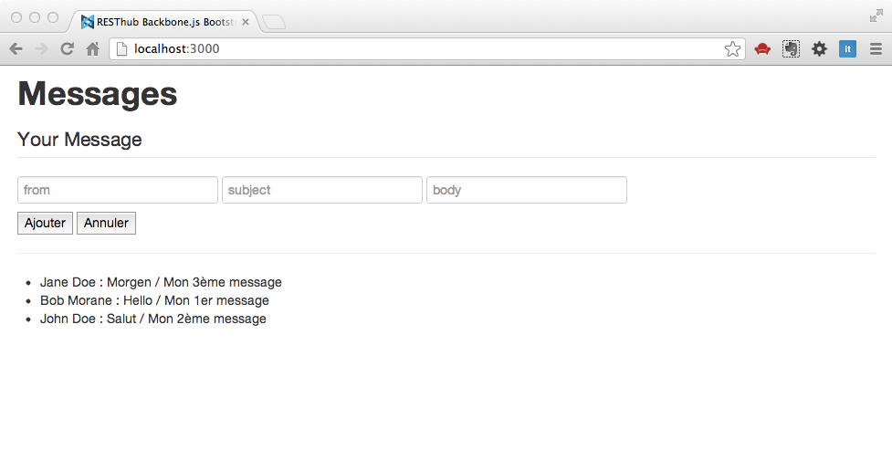

#RESThub Backbone Stack

>>*Ou comment organiser son code de manière professionnelle*

>*Sommaire*

>>- *Cht'ite intro*
>>- *Cht'ite stack server avant de commencer*
>>- *Cht'ite application*

##RESThub Backbone Stack : mais qu'est-ce donc ?

Pour faire court, RestHub est une stack technique Java orientée MVC et services REST, c'est un framework opensource (Lyonnais :) ) [http://resthub.org/](http://resthub.org/). Il se trouve que l'équipe projet est aussi friande de javascript et a livré il y a peu une stack javascript pour RESThub à base de Backbone pour la partie cliente [http://resthub.org/backbone-stack.html](http://resthub.org/backbone-stack.html). Comme l'équipe est sympa, ils ont fait une stack js indépendante de la stack serveur, ce qui permet de l'utiliser avec n'importe quelle autre stack serveur quelle que soit la technologie utilisée.

Alors, RBS (je lui donne ce petit nom pour aller plus vite) ne vient pas seule, mais est bien accompagnée, puisqu'elle embarque :

- twitter bootstrap
- handelbars
- underscore (forcément)
- jquery (forcément)
- async.js
- require.js
- etc. ...

Et notamment des composants maison tels **backbone-datagrid** :

[https://github.com/loicfrering/backbone.datagrid](https://github.com/loicfrering/backbone.datagrid)

et plein d'autres bonnes choses.

L'objet de ce chapitre n'étant pas de faire le tour complet de RBS, mais de vous mettre le pied à l'étrier, de vous donner des idées, de trouver des exemples de bonnes pratiques (l'utilisation de require.js est un modèle du genre), et surtout de vous faire plaisir.

##Avant de s'en servir, nous avons besoin d'une "stack serveur"

Normalement, vous avez Node et npm installés, donc créez un répertoire `rbs` (par exemple), puis :

  cd rbs
  npm install express
  npm install nstore

dans `rbs`, créez un répertoire `public`, puis toujours dans `rbs`, créez un fichier `app.js`, avec le code suivant :

```javascript
/*--------------------------------------------
  Déclaration des librairies
--------------------------------------------*/
var express = require('express'),
  nStore = require('nstore'),
  app = express();

nStore = nStore.extend(require('nstore/query')());

/*--------------------------------------------
  Paramétrages de fonctionnement d'Express
--------------------------------------------*/
app.use(express.json());
app.use(express.urlencoded());
app.use(express.methodOverride());
app.use(express.static(__dirname + '/public'));
app.use(express.cookieParser('ilovebackbone'));
app.use(express.session({
  secret: "ilovebackbone"
}));

/*--------------------------------------------
  Définition de la base
--------------------------------------------*/
var models;

models = nStore.new("models.db", function() {
  Routes();
  app.listen(3000);
  console.log('Express app started on port 3000');
});


function Routes() {
  /*
    Obtenir la liste de tous les models lorsque
    l'on appelle http://localhost:3000/models
    en mode GET
  */
  app.get('/models', function(req, res) {
    models.all(function(err, results) {
      if (err) {
        console.log("Erreur : ", err);
        res.json(err);
      } else {
        var models = [];
        for (var key in results) {
          var model = results[key];
          model.id = key;
          models.push(model);
        }
        res.json(models);
      }
    });
  });

  /*
    Obtenir la liste de tous les models correspondant à un critère
    lorsque l'on appelle http://localhost:3000/models/ en
    mode GET avec une requête en paramètre
    ex : query : { "kind" : "message"} }
  */
  app.get('/models/:query', function(req, res) {
    models.find(JSON.parse(req.params.query), function(err, results) {
      if (err) {
        console.log("Erreur : ", err);
        res.json(err);
      } else {
        var models = [];
        for (var key in results) {
          var model = results[key];
          model.id = key;
          models.push(model);
        }
        res.json(models);
      }
    });

  });

  /*
    Retrouver un model par sa clé unique lorsque
    l'on appelle http://localhost:3000/models/identifiant_du_model
    en mode GET
  */

  app.get('/models/:id', function(req, res) {
    models.get(req.params.id, function(err, post, key) {
      if (err) {
        console.log("Erreur : ", err);
        res.json(err);
      } else {
        model.id = key;
        res.json(model);
      }
    });
  });

  /*
    Créer un nouveau model lorsque
    l'on appelle http://localhost:3000/models
    avec en paramètre le post au format JSON
    en mode POST
  */
  app.post('/models', function(req, res) {
    var d = new Date(),
      model = req.body;
    model.saveDate = (d.valueOf());

    models.save(null, model, function(err, key) {
      if (err) {
        console.log("Erreur : ", err);
        res.json(err);
      } else {
        model.id = key;
        res.json(model);
      }
    });
  });


  /*
    Mettre à jour un model lorsque
    l'on appelle http://localhost:3000/blogpost
    avec en paramètre le post au format JSON
    en mode PUT
  */
  app.put('/models/:id', function(req, res) {
    var d = new Date(),
      model = req.body;
    model.saveDate = (d.valueOf());

    models.save(req.params.id, model, function(err, key) {
      if (err) {
        console.log("Erreur : ", err);
        res.json(err);
      } else {
        res.json(model);
      }
    });
  });

  /*
    supprimer un model par sa clé unique lorsque
    l'on appelle http://localhost:3000/blogpost/identifiant_du_post
    en mode DELETE
  */
  app.delete('/models/:id', function(req, res) {
    models.remove(req.params.id, function(err) {
      if (err) {
        console.log("Erreur : ", err);
        res.json(err);
      } else {
        //petit correctif de contournement (bug ds nStore) :
        //ré-ouvrir la base lorsque la suppression a été faite
        models = nStore.new("models.db", function() {
          res.json(req.params.id);
          //Le modèle est vide si on ne trouve rien
        });
      }
    });
  });

}

```

##Installation de RBS

Télécharger la stack complète ici : [https://github.com/resthub/resthub-backbone-stack/downloads](https://github.com/resthub/resthub-backbone-stack/downloads).

Dézippez et coller le contenu de la racine dans le répertoire `rbs/public`.

Vous devriez avoir une arborescence de ce type :

  rbs-|
    |-node_modules\
    |-public\
    |    |-css\
    |    |-img\
    |    |-js\
    |       |-build\
    |       |-lib\
    |       |-router\
    |       |-app.js
    |       |-main.js
    |-index.html

Le script `public/js/app.js` contiendra votre code applicatif (ou partie de code), le script `public/js/main.js` permet de "charger" l'ensemble des scripts nécessaires (par exemple, ceux qui sont dans `public/js/lib` comme Backbone, Underscore, jQuery, etc. ...), puis de lancer le code contenu dans `app.js`.

La déclaration dans la page `index.html` se fait de la manière suivante `<script data-main="js/main" src="js/lib/require.js"></script>`.

Ensuite dans `js`, créez les répertoires suivants `models`, `views`, `collections` et dans `public` un répertoire `templates`. Notre arborescence devrez ressemblez à ceci :

  rbs-|
    |-node_modules\
    |-public\
    |    |-css\
    |    |-img\
    |    |-templates\
    |    |-js\
    |       |-models\
    |       |-collections\
    |       |-views\
    |       |-build\
    |       |-lib\
    |       |-router\
    |       |-app.js
    |       |-main.js
    |-index.html

Il nous reste une petite modification du fichier `main.js` à faire, vers la fin du fichier, vous devez avoir une ligne `template: '../template'` que vous remplacez par `templates: '../templates',`. Oui, je sais, j'aurais pu nommer mon réperoire `templates` en `template`, mais que voulez vous, chacun ses petites habitudes.

Maintenant nous pouvons coder rapidement une petite application : une liste de messages, avec un formulaire qui vous permet d'ajouter des messages, tout en les sauvegardant sur le serveur. Je sais, ce n'est pas mieux qu'une todo list, mais à vous d'être créatifs (moi, je fais du déblayage ;))

##Création d'un modèle et d'une collection

Dans `js/models`, créez le fichier `message.js` avec le contenu suivant :

```javascript
define(['backbone'], function(Backbone) {

  var Message = Backbone.Model.extend({
    urlRoot: "/models"
  });

  return Message;

});
```

Dans `js/collections`, créez le fichier `messages.js` avec le contenu suivant :

```javascript
define([
  'backbone',
  'models/message'], function(Backbone, Message) {

  var Messages = Backbone.Collection.extend({
    url: "/models",
    model: Message
  });

  return Messages;

});
```

>>**Premières remarques :** vous pouvez voir que dans chacun des fichiers, on déclare les dépendances nécessaires (un peu comme le `import` en java) à Backbone et aux modèles.


##Templates

Nous allons avoir besoin d'un formulaire de saisie de message, et d'une liste de messages.

###Template formulaire

Dans `public/templates` créez un fichier `message-forms.hbs` avec le code suivant :

```html
<fieldset>
  <legend>Your Message</legend>
  <input type="text" data-field="from" placeholder="from" />
  <input type="text" data-field="subject" placeholder="subject" />
  <input type="text" data-field="body" placeholder="body" />
  <br>
  <button data-action="add" type="button">Ajouter</button>
  <button data-action="cancel" type="button">Annuler</button>
</fieldset>
```

>>*les attributs `data-field` ne sont pas une spécificité RestHub, c'est pour me faciliter la vie plus tard quand je vais devoir récupérer les valeurs de mon formulaire.*

###Template de liste

Dans `public/templates` créez un fichier `message.hbs` avec le code suivant :

```html
<ul>
  {{#each collection}}
    <li>{{from}} : {{subject}} / {{body}}</li>
  {{/each}}
</ul>
```

##Vues associées aux templates

Nous allons créer dans `public/js/views` 2 vues backbone associées à chacun des templates.

###messages-view.js

```javascript
define([
  'resthub',
  'hbs!templates/messages'],

function(Resthub, messagesTemplate) {

  var MessagesView = Resthub.View.extend({
    el: $('#messages'),
    template: messagesTemplate,

    initialize: function() {
      this.collection.on('reset', this.render, this);
      this.collection.on('add', this.render, this);
    }
  });

  return MessagesView;
});
```

>>*Notez l'utilisation de Resthub.View qui est une version améliorée de Backbone.View fournissant notamment une implémentation par défaut du render() ainsi que la gestion de l'élément $root sur lequel est attaché la vue ($el représentant l'élément DOM de la vue elle même) ainsi que tout un tas de fonctionnalités très pratiques*

>>*Remarquez ceci : `'hbs!templates/messages'` pour référencer les template*

>>*avec `this.collection.on('reset', this.render, this);`, j'explique qu'à chaque `reset` de la collection, je déclenche un rendu de ma vue, et il se trouve que la méthode `reset()` est déclenchée à chaque fois que l'on fait un `fetch` de la collection*

###message-form-view.js

```javascript
define([
  'backbone',
  'hbs!templates/message-form',
  'models/message'],

function(Resthub, messageFormTemplate, Message, MessagesView) {

  var MessageFormView = Resthub.View.extend({
    el: $('#message_form'),
    template: messageFormTemplate,

    events: {
      "click button[data-action='add']": 'add',
      "click button[data-action='cancel']": 'cancel',
    },

    initialize: function() {
      this.render();
    },

    add: function() {
      var model = new Message();
      var view = this;

      this.$el.find("input[data-field]").each(function() {
        model.set(this.getAttribute("data-field"), this.value);
      })

      model.save({}, {
        success: function() {
          view.collection.fetch({
            success: function() {
              view.$el[0].reset();
            },
            error: function(err) {
              throw err;
            }
          });
        },
        error: function(err) {
          throw err;
        }
      });

    },
    cancel: function() {
      console.log("CANCEL");
      this.$el[0].reset();
    }
  });
  return MessageFormView;
});
```

>>*Notez, qu'à chaque fois que je sauvegarde un modèle, je "fetch" ma collection qui va donc déclencher un `render` de l'instance de `MessagesView`*;

##app.js

Il est temps d'apposer la touche finale, et de saisir le code suivant dans `app.js` :

```javascript
define([
  'collections/messages',
  'views/messages-view',
  'views/message-form-view'],

function(Messages, MessagesView, MessageFormView) {

  window.messages = new Messages();
  window.messagesView = new MessagesView({
    collection: messages
  });
  window.messageForm = new MessageFormView({
    collection: messages
  });

  messages.fetch();
});
```

Vous pouvez maintenant lancer votre application : `node app.js` et vérifier que tout fonctionne.

\


##Conclusion

Voilà, il existe dans la stack RESThub Backbone, de nombreux autres composants que je n'ai pas encore eu le temps d'étudier et qui certainement permettent de faire du code plus simple que celui que je vous montre, mais je tenais à vous parler de cette stack car l'organisation des différents fichiers de scripts, templates… ainsi que la gestion des dépendance me plaît beaucoup, et est sans nul doute un critère de réussite sur un projet en équipe. Ce côté structurant peut paraître fastidieux au départ, mais au bout de quelques heures de code intensif, vous vous apercevrez que vous retrouvez beaucoup plus facilement vos petits.
